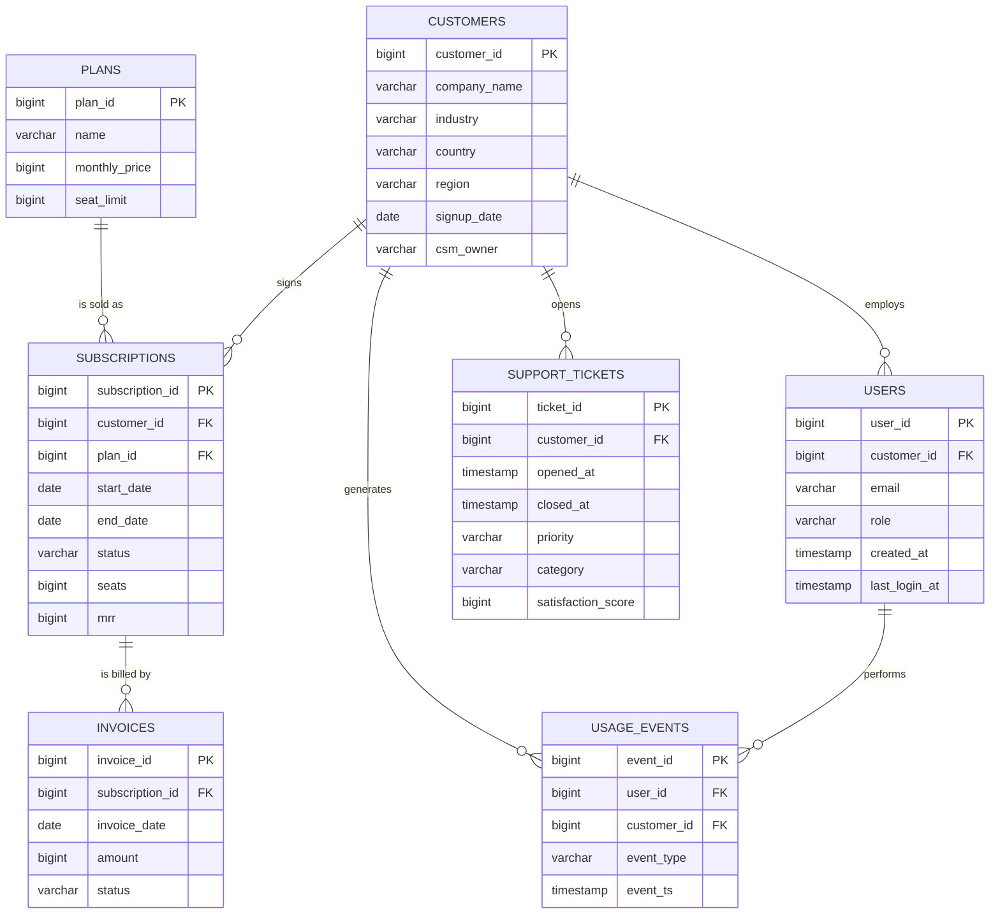

# The Northwind Analytics dataset

Northwind Analytics is a fictional B2B SaaS company. It sells an analytics
product to other companies on four plans. Everything in these seven CSV files
is invented, but the shape of the data matches what you would actually find
inside a real SaaS company's database.

You will use this dataset from module 03 all the way through module 09. That
is on purpose: by the time you get to the capstone you will know these tables
well enough to write queries without looking anything up, which is exactly how
a solutions engineer knows their own product's data model.

## The files

| file | rows | what one row means |
|---|---|---|
| `plans.csv` | 4 | one pricing plan Northwind sells |
| `customers.csv` | 200 | one company that bought Northwind |
| `subscriptions.csv` | 269 | one plan a customer was on for a period of time |
| `users.csv` | 2,213 | one individual person inside a customer company |
| `usage_events.csv` | 38,382 | one thing a user did in the product |
| `support_tickets.csv` | 1,615 | one support request a customer opened |
| `invoices.csv` | 2,333 | one bill sent to a customer |

All dates fall between 2024-01-01 and 2026-08-31.

## Schema

Types below are what DuckDB infers when it reads the CSVs.

### plans

| column | type | notes |
|---|---|---|
| `plan_id` | BIGINT | primary key |
| `name` | VARCHAR | Free, Starter, Pro, Enterprise |
| `monthly_price` | BIGINT | list price per seat per month, in US dollars |
| `seat_limit` | BIGINT | maximum seats allowed on the plan |

### customers

| column | type | notes |
|---|---|---|
| `customer_id` | BIGINT | primary key |
| `company_name` | VARCHAR | not unique on purpose, see quirks below |
| `industry` | VARCHAR | Software, Financial Services, Healthcare, Retail, Manufacturing, Education, Logistics, Media |
| `country` | VARCHAR | ten countries |
| `region` | VARCHAR | NA, EMEA, APAC, LATAM |
| `signup_date` | DATE | the day the company first became a customer |
| `csm_owner` | VARCHAR | assigned customer success manager, NULL for 15 self-serve accounts |

### subscriptions

| column | type | notes |
|---|---|---|
| `subscription_id` | BIGINT | primary key |
| `customer_id` | BIGINT | foreign key to `customers.customer_id` |
| `plan_id` | BIGINT | foreign key to `plans.plan_id` |
| `start_date` | DATE | when this subscription began |
| `end_date` | DATE | when it ended, NULL if it is still running |
| `status` | VARCHAR | active, churned, trial |
| `seats` | BIGINT | seats purchased |
| `mrr` | BIGINT | monthly recurring revenue in US dollars, equal to `monthly_price * seats` |

### users

| column | type | notes |
|---|---|---|
| `user_id` | BIGINT | primary key |
| `customer_id` | BIGINT | foreign key to `customers.customer_id` |
| `email` | VARCHAR | invented, the domain matches the company name |
| `role` | VARCHAR | admin, member, viewer |
| `created_at` | TIMESTAMP | when the user account was created |
| `last_login_at` | TIMESTAMP | NULL for 269 users who never logged in |

### usage_events

| column | type | notes |
|---|---|---|
| `event_id` | BIGINT | primary key, ordered by time |
| `user_id` | BIGINT | foreign key to `users.user_id` |
| `customer_id` | BIGINT | foreign key to `customers.customer_id`, stored again for convenience |
| `event_type` | VARCHAR | login, report_created, export, api_call, dashboard_viewed |
| `event_ts` | TIMESTAMP | when it happened |

### support_tickets

| column | type | notes |
|---|---|---|
| `ticket_id` | BIGINT | primary key, ordered by open time |
| `customer_id` | BIGINT | foreign key to `customers.customer_id` |
| `opened_at` | TIMESTAMP | when the ticket was created |
| `closed_at` | TIMESTAMP | NULL for 229 tickets that are still open |
| `priority` | VARCHAR | low, medium, high, urgent |
| `category` | VARCHAR | Billing, Integration, Bug, How-to, Data Import, Performance, Access |
| `satisfaction_score` | BIGINT | 1 to 5, NULL when the ticket is open or the customer never answered the survey |

### invoices

| column | type | notes |
|---|---|---|
| `invoice_id` | BIGINT | primary key |
| `subscription_id` | BIGINT | foreign key to `subscriptions.subscription_id` |
| `invoice_date` | DATE | one invoice per month per paid subscription |
| `amount` | BIGINT | US dollars, equal to the subscription's `mrr` |
| `status` | VARCHAR | paid, overdue, void |

Free plans and trials are never invoiced, so not every subscription has
invoices.

## How the tables connect



If that diagram does not render as a picture for you, you are looking at the
raw file. Open this page on GitHub, where Mermaid diagrams render
automatically. Module 05 teaches you to read and write these diagrams.

## Deliberate messiness

Clean data teaches you nothing. Every one of these is a real problem you will
hit on a customer call, and a later module points at it.

| quirk | where | why it is there |
|---|---|---|
| 15 customers have no `csm_owner` | `customers` | NULL is not zero and not an empty string. Module 03. |
| 269 users have no `last_login_at` | `users` | "Inactive user" and "user who never started" are different answers. Module 03. |
| 229 tickets have no `closed_at` | `support_tickets` | Average resolution time silently ignores open tickets. Module 03. |
| 627 tickets have no `satisfaction_score` | `support_tickets` | Survey response bias. `AVG` skips NULLs, `COUNT(*)` does not. Module 03. |
| six company names appear twice with different `customer_id` | `customers` | Duplicate accounts. Counting companies by name gives a different number than counting by id. Module 04. |
| customers who upgraded have two subscription rows | `subscriptions` | The old row is `churned` with an `end_date`, the new row is `active`. Counting churned subscriptions is not counting churned customers. Modules 03 and 04. |
| 90 invoices are `overdue`, 43 are `void` | `invoices` | Revenue reporting has to decide which statuses count. Module 04. |
| some customers have no invoices at all | `invoices` | Free and trial customers. This is why you need a LEFT JOIN. Module 04. |

## Regenerating the data

The CSVs are committed to the repo, so you never have to run this. If you want
to anyway:

```bash
python datasets/generate.py
```

The script uses only the Python standard library, needs no installs, and is
seeded with `random.seed(42)`, so it produces byte-identical files every time.
Change `SEED` at the top of the file if you want a different world.

## Loading the data into DuckDB

Full instructions are in module 03. The short version, run from the repo root:

```bash
duckdb northwind.duckdb
```

```sql
CREATE TABLE plans            AS SELECT * FROM read_csv_auto('datasets/plans.csv');
CREATE TABLE customers        AS SELECT * FROM read_csv_auto('datasets/customers.csv');
CREATE TABLE subscriptions    AS SELECT * FROM read_csv_auto('datasets/subscriptions.csv');
CREATE TABLE users            AS SELECT * FROM read_csv_auto('datasets/users.csv');
CREATE TABLE usage_events     AS SELECT * FROM read_csv_auto('datasets/usage_events.csv');
CREATE TABLE support_tickets  AS SELECT * FROM read_csv_auto('datasets/support_tickets.csv');
CREATE TABLE invoices         AS SELECT * FROM read_csv_auto('datasets/invoices.csv');
```

`northwind.duckdb` is listed in `.gitignore`, so your database file stays out
of Git. The CSVs are the source of truth.
