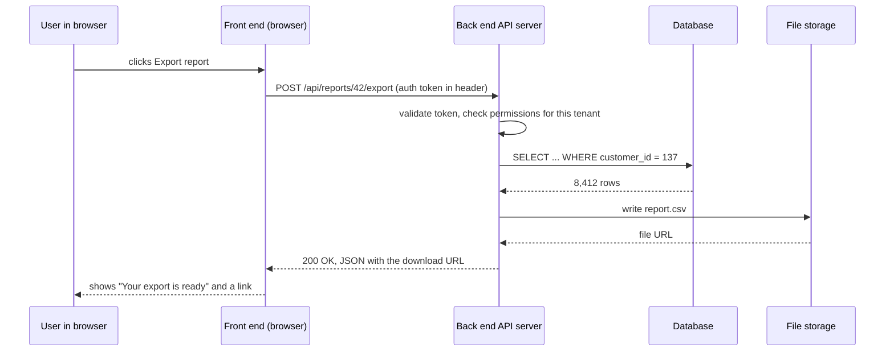

# 01. How software works

## Why an SE needs this

On a discovery call the customer's IT director asks: "Where does our data
actually live, and what happens to it when my team clicks Export?" The AE looks
at you. There is no way to answer that without a working mental model of client,
server, database, and network, and there is no way to fake one. This module
builds that model once, in plain language, so that every later module has
somewhere to attach. It is also the module that makes you stop nodding along in
meetings and start following them.

## What you will be able to do

- Explain client, server, front end, back end, and database, and say which one
  a given piece of software is.
- Trace one button click from a browser to a database and back.
- Explain what "the cloud" means without hand-waving.
- Describe what an API is and why every B2B software company is asked about
  theirs.
- Explain SaaS versus on-premise, and multi-tenant versus single-tenant, at the
  level a security questionnaire asks.
- Open browser developer tools, watch network requests, and read a JSON
  response.

## Concepts

### Client and server

A **client** is the thing in front of the user: a browser tab, a phone app, a
desktop app. A **server** is a computer somewhere else that holds the data and
the logic and answers requests. Everything you use at work is a conversation
between the two.

The conversation is always the same shape. The client sends a **request**. The
server sends back a **response**. The client never reaches into the server's
data directly; it asks, and the server decides what to send. That one sentence
is the basis of every security answer you will ever give.

A **request** carries: where it is going (a **URL**), what it wants done (a
**method**, like GET to read or POST to create), some **headers** (metadata,
including who you are), and sometimes a **body** (the data being sent). A
**response** carries a **status code** (200 means it worked, 404 means not
found, 500 means the server broke) and usually a body. Module 06 lives in this
detail; for now, notice that there are only ever two messages.

### Front end, back end, database

Three layers, and almost every SaaS product has all three.

| layer | what it is | what it does | example technology |
|---|---|---|---|
| **front end** | the code that runs in the browser | draws the screen, reacts to clicks, sends requests | HTML, CSS, JavaScript, React |
| **back end** | the code that runs on the server | checks permissions, applies business rules, talks to the database | Python, Java, Go, Node |
| **database** | organized storage on the server side | stores the data and answers queries | PostgreSQL, MySQL, Snowflake |

Two rules that come up constantly in customer conversations. The front end can
never be trusted, because it runs on the customer's machine where anyone can
change it, so every permission check happens on the back end. And the database
is never exposed to the browser directly; the back end is the only thing
allowed to talk to it. When a customer asks "can our users query the database,"
the answer is "not directly, but here is our API and here is our reporting
export."

### A **database** and why one company has many

A **database** is software whose entire job is storing data in a structured way
and answering questions about it quickly and safely. A **query** is a question,
written in SQL, which is module 03.

A single company usually runs several, for good reasons:

| database | purpose |
|---|---|
| the **production** database | serves the live product, tuned for fast small writes |
| the **data warehouse** | a copy reshaped for analytics, tuned for large reads |
| the **CRM** (Salesforce, HubSpot) | sales and account data, owned by a different team |
| the billing system | invoices and payments, often a third-party product |

This is why "how many customers do we have" can honestly return four different
numbers at one company, and why an SE spends real time on which system is the
source of truth for a given field. That question, asked early, prevents most
integration disasters.

### What "the cloud" is

The cloud is other people's computers, rented by the hour, in buildings called
**data centers**. Amazon (AWS), Microsoft (Azure), and Google (GCP) own most of
them. When a vendor says "we are hosted on AWS in us-east-1," they mean their
servers run on Amazon's hardware in Amazon's Northern Virginia **region**.

Three consequences you will be asked about:

- **Region matters legally.** A German customer may require their data stay in
  the EU. That is **data residency**, and it is a yes-or-no question with a
  contract attached.
- **The vendor does not own the hardware**, so their uptime depends partly on
  the cloud provider's. Status pages exist for this reason.
- **"The cloud" is not automatically less secure**, and the honest answer to a
  nervous customer is that AWS's physical and network security is better than
  almost any company's own server room. What varies is what the vendor does on
  top of it. Module 08 gives you that vocabulary.

### SaaS versus on-premise, and multi-tenancy

**SaaS** (software as a service) means the vendor runs the software and the
customer accesses it over the internet, paying a subscription.
**On-premise** means the customer installs it on their own servers and runs it
themselves.

| | SaaS | on-premise |
|---|---|---|
| who runs the servers | the vendor | the customer |
| upgrades | automatic, everyone at once | the customer schedules them, versions drift |
| data location | vendor's cloud region | customer's building or cloud account |
| typical buyer objection | "our data is on someone else's machine" | "we have to staff this ourselves" |
| commercial model | subscription | license plus maintenance |

**Multi-tenant** means one running copy of the software serves many customers,
with every record tagged by which customer it belongs to. In the Northwind
dataset that tag is `customer_id`, on nearly every table. **Single-tenant**
means each customer gets their own isolated copy.

Multi-tenancy is what makes SaaS cheap, and it is what security reviewers ask
about most: "How do you ensure our data is not visible to another customer?"
The real answer is that every query is scoped by tenant id, enforced in the
back end rather than in the front end, and often reinforced at the database
level. Being able to say that sentence calmly is worth a lot in a room.

### What an API is

An **API** (application programming interface) is a documented way for one
piece of software to ask another piece of software for something. A user
interface is for humans; an API is the same capability exposed for programs.

The customer-facing meaning: if the product has a good API, the customer's
other systems can talk to it, and the customer is not stuck copying
spreadsheets between tools. "Does your product have an API" appears on almost
every technical evaluation, and the follow-ups are always: is it documented, is
it REST, how do we authenticate, and what are the rate limits. Module 06
answers all four.

### The lifecycle of one button click

A user at Northwind clicks **Export report**. Here is every step, and it is the
diagram you should be able to draw on a whiteboard.



Nine steps. Now notice what each one gives you in a customer conversation:

- Step 2 is where **authentication** happens, so "how do we log in with SSO" is
  a question about this arrow.
- Step 3 is the **tenant check**. "Can another customer see our data" is a
  question about this arrow.
- Step 4 is the **query**, and "why is the export slow" is usually a question
  about this arrow.
- Step 6 is **storage**, and "where is that file stored and for how long" is a
  data retention question.

Every technical question a customer asks lands on one of these arrows. When you
cannot answer a question, the useful move is to figure out which arrow it is
about, then ask your engineering team about that specific arrow.

When something breaks, the same diagram tells you where to look. A 401 means
step 3 rejected you. A 404 means the URL in step 2 is wrong. A 500 means
something after step 3 failed on the server. Nothing at all means the request
never left the browser.

## Walkthrough

Watch a real request and response with the tools already on your laptop. No
installs.

Step 1. Open Chrome or Edge, go to <https://github.com>, and press F12 to open
**developer tools**. Click the **Network** tab. It is empty because it only
records from the moment it opens.

Step 2. Reload the page. The list fills with dozens of rows. Each row is one
request the browser made: the HTML document, stylesheets, images, fonts, and
data calls. One page view is not one request; it is often a hundred.

Step 3. Click any row and look at the right-hand panel. **Headers** shows the
request URL, the method, the status code, and the headers. **Response** shows
what came back. This panel is where you will spend module 06.

Step 4. Now look at a response that is pure data instead of a page. In the same
browser, open:

```text
https://api.github.com/repos/duckdb/duckdb
```

You get **JSON**: no styling, no layout, just data in the format programs use
to talk to each other. Trimmed to the interesting parts, the response is:

```json
{
  "full_name": "duckdb/duckdb",
  "description": "DuckDB is an analytical in-process SQL database management system",
  "language": "C++",
  "stargazers_count": 41059,
  "open_issues_count": 851,
  "license": { "key": "mit", "name": "MIT License", "spdx_id": "MIT" },
  "created_at": "2018-06-26T15:04:45Z"
}
```

Read the shape. Curly braces are an **object**, which is a set of
`"name": value` pairs. Values are text, numbers, true or false, `null`, a list
in square brackets, or another object (`license` is an object inside an
object). That is the entire JSON specification, and you have just learned it.

Step 5. Check the status code and content type in the Network tab for that
request:

```text
200 OK
content-type: application/json; charset=utf-8
```

200 means the server did what was asked. `application/json` tells the client
how to interpret the body.

Step 6. Say the sentence out loud: "The GitHub website and the GitHub API are
the same data with two different front doors. The website returns HTML for
people; the API returns JSON for programs." That sentence is the whole concept
of an API, and you just verified it yourself in a browser.

## Exercises

Answers in `solutions.md`.

1. For each of these, say whether it is a client, a server, or both: Chrome,
   the Slack desktop app, a PostgreSQL database, the Northwind back end, your
   laptop.
2. Draw the button-click lifecycle from memory, on paper, for a different
   action: a user changes their password. Then compare it to the diagram above
   and note what you missed.
3. Open developer tools on any site you use and find one request that returns
   JSON. Write down its URL, its status code, and three field names from the
   response.
4. A customer asks: "If we use your SaaS product, can your other customers see
   our data?" Write the answer in three sentences, using the words
   multi-tenant, tenant id, and back end.
5. A customer asks: "Can we run your product in our own data center?" Write two
   follow-up questions you would ask before answering, and say why each one
   matters.
6. List the four databases a mid-size SaaS company typically has and one
   question each that only that database can answer.
7. Explain data residency to someone non-technical in two sentences, then say
   what you would need to check before promising an EU customer their data
   stays in the EU.
8. A user reports that clicking Export does nothing. Using the lifecycle
   diagram, list four things you would check, in order, and what each result
   would tell you.

## Checkpoint

<details>
<summary>1. Why is a permission check never done in the front end?</summary>

The front end runs on the user's own machine, where they can inspect and modify
it. Any check there can be bypassed. The back end runs on the vendor's servers,
so it is the only place a rule can actually be enforced.
</details>

<details>
<summary>2. What is multi-tenancy, and how is one customer's data kept separate from another's?</summary>

One running copy of the application serves many customers, with every record
tagged by a tenant identifier such as `customer_id`. Every query is scoped by
that identifier in the back end, and it is commonly enforced at the database
level as well, so no request can return another tenant's rows.
</details>

<details>
<summary>3. What does a 401 status code tell you about where a failure happened?</summary>

Authentication failed: the request reached the server, but the server did not
accept the credentials. That is a problem with the token, key, or session, not
with the URL and not with the database.
</details>

<details>
<summary>4. What is JSON, in one sentence, and what are its building blocks?</summary>

A text format for structured data that programs exchange. Objects in curly
braces holding `"name": value` pairs, arrays in square brackets, and values
that are text, numbers, booleans, null, or nested objects and arrays.
</details>

<details>
<summary>5. A customer says "we don't want our data in the cloud." What do you ask next?</summary>

What specifically concerns them: physical location and data residency,
regulatory obligations, or a policy about third-party processors. The answer
determines whether the fix is a region choice, a compliance document, or a
genuine on-premise requirement, and those are three very different
conversations.
</details>

You can now say:

- "I can trace a request from a browser through an API and a database and back,
  and name what happens at each step."
- "I understand multi-tenant SaaS architecture and can explain how customer
  data is isolated."
- "I use browser developer tools to inspect network requests and read JSON
  responses when something is not working."

## Put it on your résumé

- Documented the end-to-end request lifecycle of a SaaS export feature, from
  browser through API authentication, tenant-scoped query, and file storage,
  as a diagram used to answer customer architecture questions.

## Go deeper

- [MDN: How the web works](https://developer.mozilla.org/en-US/docs/Learn/Getting_started_with_the_web/How_the_Web_works)
  - fifteen minutes, and the most accurate short explanation available.
- [Chrome DevTools Network
  panel](https://developer.chrome.com/docs/devtools/network/) - the reference
  for the tool you just used; skim the filtering section.
- [What is SaaS (AWS)](https://aws.amazon.com/what-is/saas/) - vendor-neutral
  enough, and it uses the vocabulary customers use.
- [JSON.org](https://www.json.org/json-en.html) - the entire JSON
  specification, on one page, readable in five minutes.
- [System Design Primer, "basics"
  section](https://github.com/donnemartin/system-design-primer) - far more than
  you need; read only the first few sections for the vocabulary.
