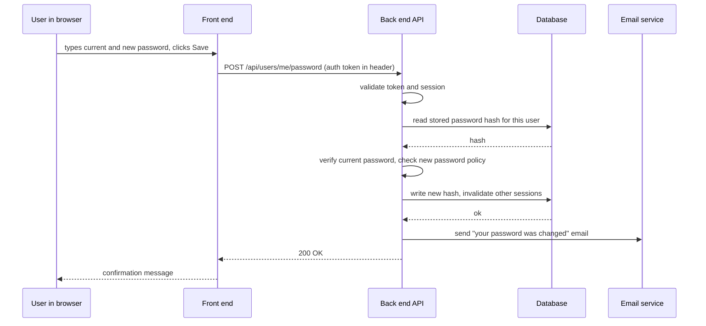

# 01. Solutions

## 1. Client, server, or both

| thing | answer | why |
|---|---|---|
| Chrome | client | it sends requests and renders what comes back |
| Slack desktop app | client | a different kind of client for the same servers |
| a PostgreSQL database | server | it answers queries; it never initiates them |
| the Northwind back end | both | it is the server to the browser and the client to the database |
| your laptop | both, depending | a client when you browse; a server when you run DuckDB or a local web app |

The point of the exercise is the third and fourth rows. Client and server are
roles in a conversation, not categories of machine. The same program is a
server to the thing above it and a client to the thing below it.

## 2. Password change lifecycle



Commonly missed steps: the password is never stored or compared in plain text,
only as a **hash**; other active sessions get invalidated; and a notification
email goes out, which is a separate system entirely. If you missed the email
service, that is the lesson: real flows touch more systems than the diagram in
your head.

## 3. Finding a JSON response

Example, from the walkthrough:

```text
URL:    https://api.github.com/repos/duckdb/duckdb
Status: 200 OK
Fields: full_name, stargazers_count, license.name
```

`license.name` uses **dot notation** to describe a field inside a nested
object. You will use that notation constantly in module 06 and module 07.

If you could not find a JSON response on the site you picked, filter the
Network tab by **Fetch/XHR**. Those are the data calls the page makes after the
HTML arrives, and they are almost always JSON.

## 4. "Can other customers see our data"

```text
Our product is multi-tenant, which means one running system serves many
customers and every record carries a tenant id identifying which customer it
belongs to. Every request is scoped to your tenant id in the back end, on the
server, where the rule cannot be bypassed by anything running in a user's
browser. The isolation is enforced on every query, not applied as a filter in
the interface.
```

The last sentence is the one that matters to a security reviewer. Filtering in
the interface is what a weak vendor does; enforcing in the back end is what
they are checking for.

## 5. "Can we run this in our own data center"

Two questions worth asking before answering:

1. "What is driving the requirement: a regulation, an internal policy, or a
   concern about a specific control?" A regulation might be satisfiable with a
   region choice or a compliance certification, which is far cheaper for both
   sides than an on-premise deployment. A policy can sometimes be updated with
   evidence. A specific concern can sometimes be answered directly.
2. "Who would operate it, and what is your expectation for upgrades and
   support?" On-premise moves patching, uptime, and backups to their team.
   Naming that early stops a deal from being sold into a bad outcome.

If your product genuinely has no on-premise option, say so plainly and early.
An SE who lets a prospect believe otherwise for three weeks has cost everyone
three weeks.

## 6. Four databases and their unique questions

| database | a question only it can answer |
|---|---|
| production application database | what is in this customer's account right now |
| data warehouse | how did usage per account change month over month for the last two years |
| CRM | who is the account executive, what stage is the renewal in |
| billing system | what did we actually invoice and collect last quarter |

The pattern to notice: "how many customers do we have" can be answered by all
four and will return four different numbers, because each defines "customer"
differently. Asking "which system is the source of truth for this field" is a
sign of experience.

## 7. Data residency

```text
Data residency means the physical country or region where your data is stored.
Some regulations and company policies require that data about EU residents
stays on servers inside the EU.
```

Before promising it, check three things: which regions the product is actually
deployed in, whether backups and disaster recovery copies stay in the same
region (they often do not), and whether any subprocessor, such as an email or
analytics vendor, moves data out. The third one is where most confident
promises turn out to be wrong.

## 8. "Clicking Export does nothing"

In order, because each step rules out a layer:

1. **Open developer tools, Network tab, and click Export again.** If no request
   appears at all, the failure is in the front end and never reached the
   server. That is a browser, extension, or JavaScript error, so check the
   Console tab next.
2. **If a request appears, read its status code.** 401 or 403 means
   authentication or permissions: this user's session or role is the problem.
   404 means the URL is wrong, which usually means a version or configuration
   mismatch. 500 means the server failed and engineering needs the request id.
3. **If the status is 200, read the response body.** A successful request that
   returns an empty result means the query found no rows, which is usually a
   filter, a date range, or a permission scope that is narrower than the user
   expects. Not a bug.
4. **If the response is fine, check the download step.** Pop-up blockers,
   browser download settings, and expired file links all produce "nothing
   happened" from the user's point of view, with a perfectly healthy API call
   behind it.

Being able to walk a customer through those four checks live, and correctly
conclude "this is on your side" or "this is on ours," is a large part of the
job in a POC.
