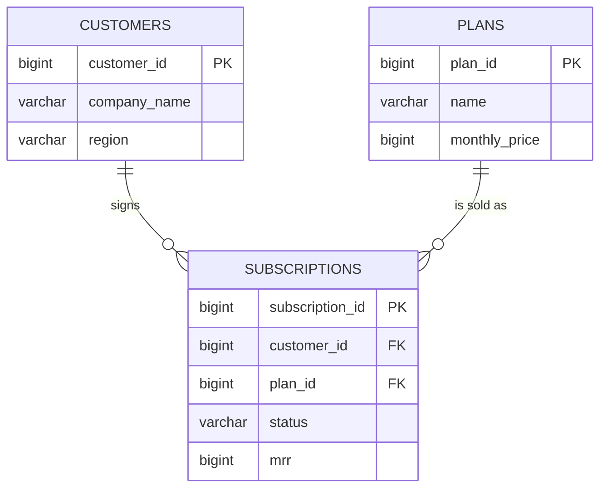
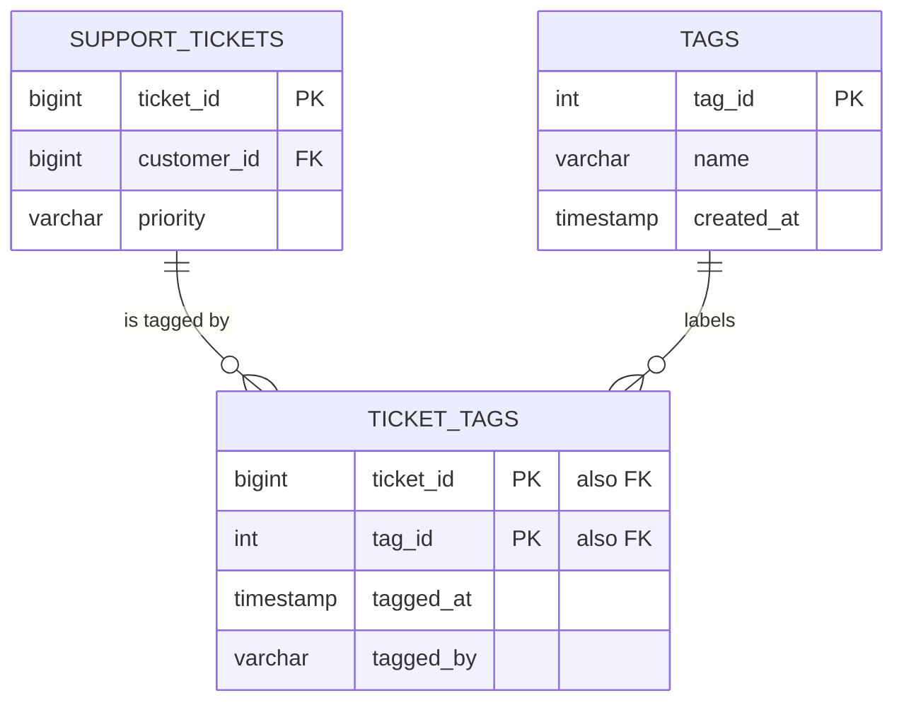

# 05. Data modeling

## Why an SE needs this

Two days after the contract is signed, the customer's IT lead emails you a
spreadsheet of their data and one sentence: "Here's our export, how does this
map to your system?" That meeting is yours. You have to read their structure,
compare it to your product's, and say out loud which of their fields becomes
which of your fields, what is missing, and what will break. Nobody expects you
to design the database. Everybody expects you to explain it, draw it, and spot
the mismatch before it becomes a two-week delay. This module gives you that
vocabulary and that drawing.

## What you will be able to do

- Identify the primary key and foreign keys of any table you are shown.
- Tell one-to-one, one-to-many, and many-to-many relationships apart, and know
  that many-to-many always needs a junction table.
- Explain in plain language why data is split across tables instead of kept in
  one giant spreadsheet.
- Read and write an entity relationship diagram in Mermaid.
- Explain facts, dimensions, and star schema well enough to follow an analytics
  conversation.
- Design a small schema change end to end and write the DDL for it.
- Produce a field-by-field data mapping document from a customer's CSV export
  to a target schema, including the transformations and the gaps.

## Concepts

### Keys

A **primary key** is the column whose value uniquely identifies one row in a
table. `customers.customer_id` is a primary key: exactly one row per value,
never NULL, never reused.

A **foreign key** is a column that holds another table's primary key value, and
that is how tables connect. `subscriptions.customer_id` is a foreign key
pointing at `customers.customer_id`.

A **natural key** is a real-world value that happens to be unique, like an
email address. A **surrogate key** is a meaningless number the database
generates, like `customer_id`. Products use surrogate keys because real-world
values change: people change email addresses and companies get renamed, and you
do not want to update forty tables when they do.

Northwind proves that point. `company_name` looks like it identifies a
customer, until you notice six names appear on two different accounts:

```sql
SELECT company_name, count(*) AS accounts
FROM customers
GROUP BY company_name
HAVING count(*) > 1;
```

Anything joined on `company_name` would silently merge two real companies. This
is the single most common integration bug, and it is why "what is your unique
identifier for an account" is a question you ask on every technical discovery
call.

**Referential integrity** means every foreign key value actually exists in the
table it points at. Databases enforce it for you: if `ticket_tags` has a
foreign key to `tags`, the database refuses to insert a tag id that does not
exist, and refuses to delete a tag that is still in use. When a customer asks
"what happens if we delete a user who has open tickets," they are asking about
referential integrity.

### Cardinality: how many of these go with how many of those

**Cardinality** is the number of rows on each side of a relationship.

| relationship | meaning | Northwind example |
|---|---|---|
| one-to-one | one row here, at most one row there | a customer and their billing address, if you split it out |
| one-to-many | one row here, many rows there | one customer has many users |
| many-to-many | many rows here relate to many rows there | tickets and tags, once you build it |

One-to-many is implemented by putting the foreign key on the **many** side.
`users` has `customer_id` because one customer has many users; `customers` does
not have a `user_id`, because which one would it hold.

Many-to-many cannot be implemented with a single column on either side. One
ticket can carry several tags, and one tag is used on thousands of tickets.
Neither table has room for a list, and a comma-separated `tags` column is the
wrong answer (you cannot join it, filter it reliably, or rename a tag).

The right answer is a **junction table**, also called a bridge or join table:
one row per pair.

```text
support_tickets            ticket_tags             tags
+-----------+              +-----------+           +--------+
| ticket_id |<-------------| ticket_id |           | tag_id |
| ...       |              | tag_id    |---------->| name   |
+-----------+              +-----------+           +--------+
```

Two one-to-many relationships pointing into the middle table make one
many-to-many relationship. Every many-to-many in every product you will ever
sell works this way: users and roles, products and categories, contacts and
lists.

### Why not one giant spreadsheet

**Normalization** is splitting data so each fact is stored exactly once. The
rules have formal names (first, second, third normal form); the working version
is: *one fact, one place, and use a key to point at it.*

Imagine Northwind as a single flat table with a row per usage event and the
company name, industry, country, CSM, and plan price repeated on all 38,382
rows.

| problem | what happens in the flat version | what the split version does |
|---|---|---|
| update | renaming a company means editing thousands of rows, and missing one leaves two spellings | update one row in `customers` |
| insert | you cannot record a customer who has not generated an event yet | insert into `customers`, no event needed |
| delete | deleting old events could erase the only record that a company exists | events and customers are independent |
| storage and typos | the same string repeated 38,382 times, each a chance to differ | stored once |

The cost of normalization is that answering a question requires joins, which is
why module 04 comes before this one. The trade is deliberate: **transactional
systems normalize** so writes stay correct, and **analytics systems
denormalize** so reads stay simple. That is the next section.

### Reading an ERD

An **ERD** (entity relationship diagram) shows tables as boxes and
relationships as lines. The crow's-foot notation on the line ends tells you the
cardinality:

| symbol | reads as |
|---|---|
| `||` | exactly one |
| `o|` | zero or one |
| `}o` | zero or many |
| `}|` | one or many |

In Mermaid, `CUSTOMERS ||--o{ USERS : employs` reads left to right: one
customer relates to zero or many users. GitHub renders Mermaid automatically,
so an ERD in a README is a diagram, not a code block, which makes this the
cheapest professional-looking artifact you can put in a repo.

Here is a three-table slice of Northwind:



The full seven-table version is in `datasets/README.md`. Read it now and check
that you can name every foreign key without scrolling.

### Facts and dimensions

Analytics teams model differently. A **fact table** holds events or
measurements: many rows, mostly numbers and foreign keys, always growing. A
**dimension table** holds the descriptive things you slice by: fewer rows,
mostly text, slowly changing.

| Northwind table | type | why |
|---|---|---|
| `usage_events` | fact | one row per action, 38,382 and counting |
| `invoices` | fact | one row per bill, has an amount |
| `support_tickets` | fact | one row per event in time |
| `customers` | dimension | who, not what happened |
| `plans` | dimension | descriptive, four rows |
| `users` | dimension | who did it |
| `subscriptions` | both, in practice | it has `mrr` to measure and it describes the relationship |

A **star schema** is one fact table in the middle with dimensions around it,
each one join away. It is called a star because that is what the diagram looks
like. The point is that any business question becomes "aggregate a measure from
the fact table, grouped by attributes from the dimensions":

```sql
SELECT p.name AS plan, c.region,
       date_trunc('month', i.invoice_date) AS month,
       sum(i.amount) AS billed
FROM invoices i
JOIN subscriptions s ON s.subscription_id = i.subscription_id
JOIN customers c ON c.customer_id = s.customer_id
JOIN plans p ON p.plan_id = s.plan_id
WHERE i.status = 'paid' AND i.invoice_date >= DATE '2026-06-01'
GROUP BY plan, c.region, month
ORDER BY month, billed DESC
LIMIT 8;
```

```text
┌────────────┬─────────┬─────────────────────┬────────┐
│    plan    │ region  │        month        │ billed │
├────────────┼─────────┼─────────────────────┼────────┤
│ Enterprise │ NA      │ 2026-06-01 00:00:00 │ 387450 │
│ Enterprise │ EMEA    │ 2026-06-01 00:00:00 │ 303930 │
│ Enterprise │ APAC    │ 2026-06-01 00:00:00 │ 145710 │
│ Enterprise │ LATAM   │ 2026-06-01 00:00:00 │ 119340 │
│ Pro        │ EMEA    │ 2026-06-01 00:00:00 │  61440 │
│ Pro        │ NA      │ 2026-06-01 00:00:00 │  55880 │
│ Pro        │ APAC    │ 2026-06-01 00:00:00 │  16400 │
│ Pro        │ LATAM   │ 2026-06-01 00:00:00 │   5240 │
└────────────┴─────────┴─────────────────────┴────────┘
```

Measure from the fact (`sum(i.amount)`), attributes from the dimensions (plan,
region, month). Every dashboard tile you build in module 09 has this shape.

Two terms you will hear next to it: a **data warehouse** is the separate
database where this analytical copy lives (Snowflake, BigQuery, Redshift), and
**ETL** or **ELT** is the process that copies data from the product's database
into it. Module 08 goes further.

### Writing DDL

**DDL** (data definition language) is the SQL that creates and changes
structure, as opposed to the queries you have been writing, which are DML.

<!-- static -->
```sql
CREATE TABLE tags (
  tag_id      INTEGER PRIMARY KEY,
  name        VARCHAR NOT NULL UNIQUE,
  created_at  TIMESTAMP DEFAULT now()
);
```

This one is here to read, not to run; you create these tables for real in the
walkthrough. Read it as four decisions: `tag_id` identifies the row, `name`
must be present and cannot repeat, `created_at` fills itself in. Those
constraints are the model. Anything you do not declare, the application has to
remember to enforce, and eventually it will not.

## Walkthrough

The kickoff-call task: **the customer wants to tag support tickets.** They want
several tags per ticket, a shared vocabulary so people cannot invent
free-text labels, and a report of tickets by tag. Design it, draw it, build it.

Step 1. Name the cardinality out loud. One ticket, many tags. One tag, many
tickets. Many-to-many, so it needs a junction table. That sentence, said in the
meeting, is most of the value you add.

Step 2. Draw it before you build it.



Step 3. Write the DDL. Run this in the browser using the boxes in the rest of
this walkthrough, in order, from here to step 7; each step builds on the one
before it. Run this box a second time and it says the table already exists,
which is correct: the tables are still there from the first run, so read the
error and move on. On your computer, open the database from the repo root with
`duckdb northwind.duckdb` and run the same statements:

```sql
CREATE TABLE tags (
  tag_id      INTEGER PRIMARY KEY,
  name        VARCHAR NOT NULL UNIQUE,
  created_at  TIMESTAMP DEFAULT now()
);

CREATE TABLE ticket_tags (
  ticket_id  BIGINT NOT NULL,
  tag_id     INTEGER NOT NULL,
  tagged_at  TIMESTAMP DEFAULT now(),
  tagged_by  VARCHAR,
  PRIMARY KEY (ticket_id, tag_id)
);
```

Two things to notice. `name` is `UNIQUE`, which is what stops "Billing",
"billing", and "billing " from becoming three tags. And the primary key of
`ticket_tags` is **composite**: two columns together identify the row, which
makes it impossible to attach the same tag to the same ticket twice. The
junction table also carries its own attributes, `tagged_at` and `tagged_by`,
because who tagged it and when is real information that belongs nowhere else.

Step 4. Put some data in.

```sql
INSERT INTO tags (tag_id, name) VALUES
  (1, 'billing-dispute'), (2, 'needs-engineering'), (3, 'churn-risk');

INSERT INTO ticket_tags (ticket_id, tag_id, tagged_by) VALUES
  (1, 1, 'dana'), (1, 3, 'dana'), (2, 2, 'marcus'), (5, 3, 'priya');
```

Step 5. Prove the model does what you claimed. Ticket 1 has two tags, which is
the whole reason for the junction table:

```sql
SELECT t.ticket_id, c.company_name, t.priority, g.name AS tag
FROM support_tickets t
JOIN ticket_tags tt ON tt.ticket_id = t.ticket_id
JOIN tags g ON g.tag_id = tt.tag_id
JOIN customers c ON c.customer_id = t.customer_id
ORDER BY t.ticket_id, g.name;
```

```text
┌───────────┬───────────────────────┬──────────┬───────────────────┐
│ ticket_id │     company_name      │ priority │        tag        │
├───────────┼───────────────────────┼──────────┼───────────────────┤
│         1 │ Tidewater Group       │ low      │ billing-dispute   │
│         1 │ Tidewater Group       │ low      │ churn-risk        │
│         2 │ Westgate Freight GmbH │ high     │ needs-engineering │
│         5 │ Onyx Systems          │ low      │ churn-risk        │
└───────────┴───────────────────────┴──────────┴───────────────────┘
```

Step 6. Build the report they asked for. `LEFT JOIN` so a tag nobody has used
yet still shows up with zero:

```sql
SELECT g.name AS tag, count(tt.ticket_id) AS tickets
FROM tags g
LEFT JOIN ticket_tags tt ON tt.tag_id = g.tag_id
GROUP BY g.name
ORDER BY tickets DESC;
```

```text
┌───────────────────┬─────────┐
│        tag        │ tickets │
├───────────────────┼─────────┤
│ churn-risk        │       2 │
│ needs-engineering │       1 │
│ billing-dispute   │       1 │
└───────────────────┴─────────┘
```

Step 7. Try to break it, so you can tell the customer it is safe:

```sql
INSERT INTO ticket_tags (ticket_id, tag_id) VALUES (1, 1);
```

```text
Constraint Error: Duplicate key "ticket_id: 1, tag_id: 1" violates primary key constraint.
```

The model refuses the duplicate rather than trusting the app to check. "The
database enforces it, not the application" is a sentence that ends a security
questionnaire discussion early.

To undo everything from this walkthrough: `DROP TABLE ticket_tags; DROP TABLE
tags;`.

## Exercises

Write your answers in `solutions-worksheet.md` (create it, it is yours), then
compare with `solutions.md`. Exercises 5 through 8 are the data mapping task,
which is the closest thing in this repo to actual day-one SE work.

1. For each of the seven Northwind tables, name the primary key and every
   foreign key. Write it as a table.
2. Label the cardinality of these four relationships and say which table holds
   the foreign key: customers and users; customers and subscriptions;
   subscriptions and invoices; users and usage_events.
3. `usage_events` stores `customer_id` even though it could be reached through
   `users`. Name one advantage and one risk of that duplication.
4. Northwind wants to let one user belong to more than one customer account
   (consultants who work with several clients). Draw the Mermaid ERD for the
   change and write the DDL.
5. Open `ridgeline_export_sample.csv` in this folder. It is a prospect's CRM
   export. For every column, write the Northwind table and column it maps to,
   or "no target" if there is none.
6. For the same file, list every transformation needed to load it: format
   changes, value translations, and derived fields.
7. List the data quality problems in that export. There are at least four.
8. Write the three questions you would ask the customer on the mapping call,
   in the order you would ask them.
9. Classify each Northwind table as fact or dimension and give a one-line
   reason.
10. Northwind wants ticket tags to belong to a category ("product area",
    "sentiment", "process"), with one category per tag. Extend the walkthrough
    model: draw the ERD and write the DDL.

## Checkpoint

<details>
<summary>1. What is the difference between a primary key and a foreign key?</summary>

A primary key uniquely identifies a row in its own table. A foreign key is a
column in one table that holds the primary key value of another table, which is
what creates the relationship between them.
</details>

<details>
<summary>2. Why can't a many-to-many relationship be built with a column on either table?</summary>

Neither side can hold more than one value in a column, and a comma-separated
list cannot be joined, indexed, or reliably filtered. You need a junction table
with one row per pair, which turns the many-to-many into two one-to-many
relationships.
</details>

<details>
<summary>3. Give one concrete reason not to store the company name on every usage event.</summary>

Renaming the company would require updating 38,382 rows, and any row missed
leaves the same company under two spellings, so counts by company silently
split. Store the name once in `customers` and reference `customer_id`.
</details>

<details>
<summary>4. What is a fact table and what is a dimension table?</summary>

A fact table records events or measurements over time: many rows, numeric
measures, foreign keys to dimensions. A dimension table holds descriptive
attributes you group and filter by: fewer rows, mostly text. `invoices` is a
fact, `customers` is a dimension.
</details>

<details>
<summary>5. A customer's export has a "Tier" column with values Gold, Silver, Bronze. Your product has plan ids 1 to 4. What do you tell them?</summary>

That this is a value mapping, not just a column mapping: we need an agreed
translation for each of their values into ours, in writing, including what to
do with values that have no equivalent. Then confirm whether Tier can change
over time, because if it can, it belongs on the subscription rather than the
account.
</details>

You can now say:

- "I can read an ERD, identify primary and foreign keys, and explain why a
  many-to-many relationship needs a junction table."
- "I designed and implemented a schema change end to end: cardinality, ERD,
  DDL with constraints, and the report it enables."
- "I produce field-level data mappings from a customer export to a target
  schema, including transformations, gaps, and the questions I need answered."

## Put it on your résumé

- Modeled a many-to-many schema extension (tagging) for a seven-table SaaS
  dataset: ERD in Mermaid, DDL with composite primary key and uniqueness
  constraints, and the reporting queries it enabled.
- Produced a field-level data mapping from a customer CRM export to a target
  schema, documenting 12 field mappings, 5 required transformations, and 4 data
  quality issues raised with the customer before load.

## Go deeper

- [Mermaid ER diagram syntax](https://mermaid.js.org/syntax/entityRelationshipDiagram.html)
  - the reference for the diagrams you will put in every README from now on.
- [dbdiagram.io](https://dbdiagram.io/) - free, draw a schema by typing; useful
  when a customer wants a picture in five minutes.
- [Kimball dimensional modeling
  techniques](https://www.kimballgroup.com/data-warehouse-business-intelligence-resources/kimball-techniques/dimensional-modeling-techniques/)
  - the source of the fact and dimension vocabulary analytics teams use.
- [Database normalization, explained
  simply](https://www.freecodecamp.org/news/database-normalization-1nf-2nf-3nf-table-examples/)
  - the formal normal forms, if you want the names behind the working rule.
- [Northwind dataset README](../../datasets/README.md) - reread the ERD there
  once you finish this module; it should now read like a sentence.
