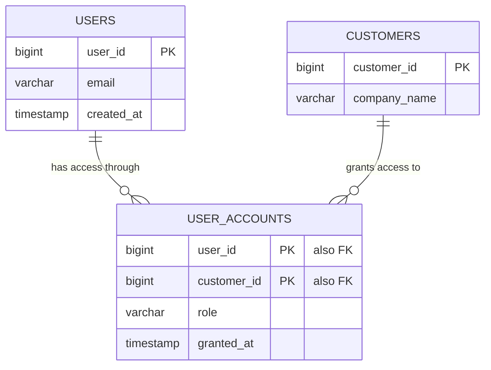
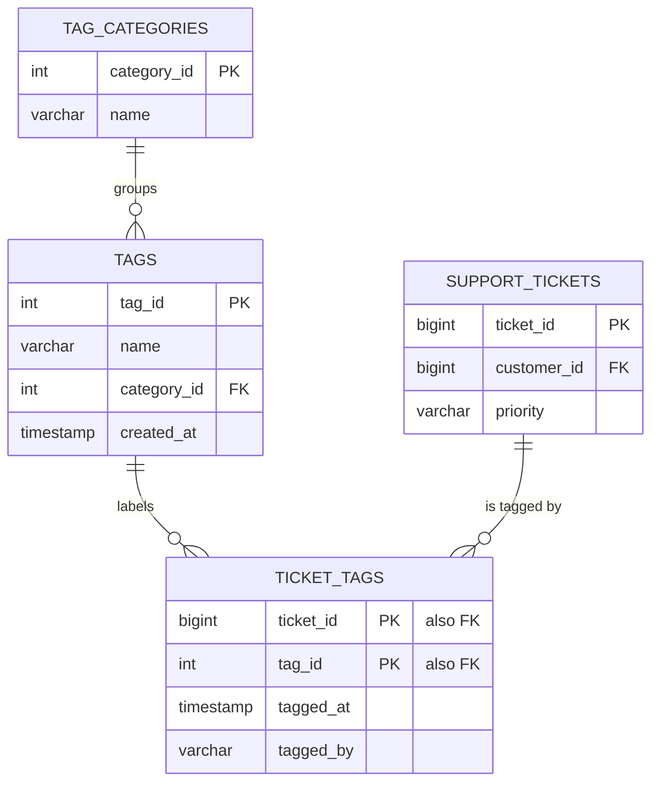

# 05. Solutions

Exercises 1 through 3 and 9 are written answers. Exercises 4 and 10 include DDL
that was executed in DuckDB. Exercises 5 through 8 are the data mapping task,
and there is no single correct answer, only a good document and a bad one; mine
is below to compare against.

## 1. Keys of every table

| table | primary key | foreign keys |
|---|---|---|
| `plans` | `plan_id` | none |
| `customers` | `customer_id` | none |
| `subscriptions` | `subscription_id` | `customer_id` to `customers`, `plan_id` to `plans` |
| `users` | `user_id` | `customer_id` to `customers` |
| `usage_events` | `event_id` | `user_id` to `users`, `customer_id` to `customers` |
| `support_tickets` | `ticket_id` | `customer_id` to `customers` |
| `invoices` | `invoice_id` | `subscription_id` to `subscriptions` |

`customers` and `plans` have no foreign keys, which is the tell that they are
the dimension tables everything else hangs off.

## 2. Cardinality

| relationship | cardinality | foreign key lives on |
|---|---|---|
| customers to users | one-to-many | `users.customer_id` |
| customers to subscriptions | one-to-many | `subscriptions.customer_id` |
| subscriptions to invoices | one-to-many | `invoices.subscription_id` |
| users to usage_events | one-to-many | `usage_events.user_id` |

The rule that generates all four: the foreign key goes on the many side.

## 3. Duplicated customer_id on usage_events

Advantage: any query that groups usage by account skips the join to `users`
entirely. On 38,382 rows that is faster, and it is simpler to write, which is
why analytics tables are denormalized on purpose.

Risk: the same fact is now stored in two places. If a user is ever reassigned
to a different account, `users.customer_id` changes and the historical
`usage_events.customer_id` values do not, so the two disagree and the same
question returns two different answers depending on which column you trust.

The professional way to describe this trade-off: it is a deliberate
denormalization for read performance, and it needs a documented rule about
which column is authoritative.

## 4. Users belonging to multiple accounts

Today the model is one-to-many, enforced by `users.customer_id`. Consultants
make it many-to-many, so it needs a junction table.



```sql
CREATE TABLE user_accounts (
  user_id      BIGINT  NOT NULL,
  customer_id  BIGINT  NOT NULL,
  role         VARCHAR NOT NULL,
  granted_at   TIMESTAMP DEFAULT now(),
  PRIMARY KEY (user_id, customer_id)
);

INSERT INTO user_accounts (user_id, customer_id, role) VALUES
  (1, 1, 'admin'), (1, 3, 'viewer'), (2, 1, 'member');
```

```sql
SELECT ua.user_id, u.email, c.company_name, ua.role
FROM user_accounts ua
JOIN users u ON u.user_id = ua.user_id
JOIN customers c ON c.customer_id = ua.customer_id
ORDER BY ua.user_id, c.company_name;
```

```text
┌─────────┬───────────────────────────┬────────────────────┬─────────┐
│ user_id │           email           │    company_name    │  role   │
├─────────┼───────────────────────────┼────────────────────┼─────────┤
│       1 │ alex.young26@redwood.com  │ Meridian Financial │ viewer  │
│       1 │ alex.young26@redwood.com  │ Redwood Analytics  │ admin   │
│       2 │ amara.smith69@redwood.com │ Redwood Analytics  │ member  │
└─────────┴───────────────────────────┴────────────────────┴─────────┘
```

Two design points worth saying in the meeting. First, `role` moves out of
`users` and onto `user_accounts`, because a consultant can be an admin on one
account and a viewer on another; a role is a property of the relationship, not
of the person. Second, `users.customer_id` becomes redundant and would have to
be migrated and dropped, which is the real work in a change like this.

## 5. Column mapping for the Ridgeline export

| their column | Northwind target | notes |
|---|---|---|
| `Account_Name` | `customers.company_name` | not unique in their file, see exercise 7 |
| `Acct_Number` | no direct target | needs a new `external_account_id` column; do not overwrite `customer_id` |
| `HQ_Country` | `customers.country` | two-letter codes, ours are full names |
| `Tier` | `plans.name` via `subscriptions.plan_id` | value mapping required |
| `Seats_Purchased` | `subscriptions.seats` | |
| `Monthly_Spend_USD` | `subscriptions.mrr` | text with thousands separators |
| `Owner_Email` | `customers.csm_owner` | ours holds a person's name, theirs an email |
| `Contract_Start` | `subscriptions.start_date` | US date format |
| `Contract_End` | `subscriptions.end_date` | blank means still running, so NULL |
| `Status` | `subscriptions.status` | value mapping required |
| `Primary_Contact_Name` | no target | `users` has no name column |
| `Primary_Contact_Email` | `users.email` | creates one user row per account |
| (derived) | `customers.region` | derive from country |
| (missing) | `customers.industry` | not in their export at all |

Twelve of their columns, two of which have no home, plus two fields of ours
they cannot fill.

## 6. Transformations required

1. `HQ_Country`: map ISO codes to our country names (US to United States, GB to
   United Kingdom, DE to Germany, JP to Japan, MX to Mexico).
2. `region`: derive from country. MX is LATAM, which is a value our existing
   data supports, but Mexico is not currently one of our ten countries, so
   confirm the list is open.
3. `Tier`: Gold to Enterprise, Silver to Pro, Bronze to Starter. Nothing maps
   to Free; ask whether that is correct.
4. `Monthly_Spend_USD`: strip quotes and commas, cast to a number.
5. `Contract_Start` and `Contract_End`: convert MM/DD/YYYY to YYYY-MM-DD, and
   convert empty string to NULL rather than to a date.
6. `Status`: Live to active, Cancelled to churned, Pilot to trial.
7. `Acct_Number`: keep as a new external id column so records can be matched
   again on the next sync. This is the field that makes the integration
   repeatable instead of one-time.

## 7. Data quality problems

1. **Duplicate account name with different account numbers.** Halverson
   Freight appears twice, RGL-00412 in the US and RGL-00511 in Germany. Two
   subsidiaries, or one company entered twice. Only they can say. Matching on
   name would merge them; matching on `Acct_Number` would not.
2. **Missing owner.** Two rows have an empty `Owner_Email`, both Pilot
   accounts. Our `csm_owner` allows NULL, so this loads, but the report
   "accounts by owner" will have an unassigned bucket they may not expect.
3. **Numbers stored as text.** `"21,600"` is a quoted string with a thousands
   separator. Loaded naively it becomes text and every revenue sum fails.
4. **Owner identity mismatch.** They send `d.whitfield@ridgeline.example`; we
   store `Dana Whitfield`. Either we add an email column or somebody maintains
   a translation list by hand, which will drift.
5. **Cancelled row with no gap check.** Vaughn Retail has an end date of
   2026-04-30 and status Cancelled, which is consistent. Worth verifying the
   rule holds across the full file rather than these eight rows.
6. **Industry is absent entirely**, so any segmentation we promised in the demo
   cannot be delivered from this file.

Four was the minimum. Finding six is better, and listing them before the load
rather than after is the entire difference between a smooth implementation and
a bad one.

## 8. Three questions for the mapping call

1. "Is `Acct_Number` unique and stable for the life of an account? I want to
   use it as the match key so re-running the sync updates records instead of
   creating duplicates."
2. "Halverson Freight appears twice with different account numbers and
   countries. Are those two separate legal entities we should keep apart, or
   one company we should merge?"
3. "Your Tier values are Gold, Silver, and Bronze, and our plans are Free,
   Starter, Pro, and Enterprise. Can we agree the translation in writing today,
   and tell me what happens when a customer changes tier mid-contract?"

Notice all three are about identity, duplicates, and change over time. Those
are the three things that break integrations, in that order.

## 9. Fact or dimension

| table | classification | reason |
|---|---|---|
| `usage_events` | fact | one row per action in time, the grain is an event |
| `support_tickets` | fact | one row per ticket event, measurable duration and score |
| `invoices` | fact | one row per bill with an amount to sum |
| `subscriptions` | fact-ish | it has a measure (`mrr`) and a validity period; analytics teams often model it as a periodic snapshot fact |
| `customers` | dimension | describes who, changes slowly |
| `plans` | dimension | four descriptive rows, the classic small dimension |
| `users` | dimension | describes who acted; the events reference it |

If someone pushes back on `subscriptions`, that is a fair argument to have.
Saying "it depends on the grain you pick" is a better answer than picking a
side.

## 10. Tag categories

One category per tag, many tags per category. That is one-to-many, so no
junction table: the foreign key goes on the many side, which is `tags`.



```sql
CREATE TABLE tag_categories (
  category_id  INTEGER PRIMARY KEY,
  name         VARCHAR NOT NULL UNIQUE
);

CREATE TABLE tags (
  tag_id      INTEGER PRIMARY KEY,
  name        VARCHAR NOT NULL UNIQUE,
  category_id INTEGER NOT NULL REFERENCES tag_categories(category_id),
  created_at  TIMESTAMP DEFAULT now()
);
```

```sql
INSERT INTO tag_categories VALUES (1, 'product area'), (2, 'sentiment'), (3, 'process');
INSERT INTO tags (tag_id, name, category_id) VALUES
  (1, 'billing-dispute', 3), (2, 'needs-engineering', 3), (3, 'churn-risk', 2);

SELECT tc.name AS category, g.name AS tag
FROM tags g
JOIN tag_categories tc ON tc.category_id = g.category_id
ORDER BY category, tag;
```

```text
┌───────────┬───────────────────┐
│ category  │        tag        │
├───────────┼───────────────────┤
│ process   │ billing-dispute   │
│ process   │ needs-engineering │
│ sentiment │ churn-risk        │
└───────────┴───────────────────┘
```

`REFERENCES tag_categories(category_id)` declares the foreign key, and the
database then refuses impossible data:

```sql
INSERT INTO tags (tag_id, name, category_id) VALUES (4, 'bad', 99);
```

```text
Constraint Error: Violates foreign key constraint because key "category_id: 99"
does not exist in the referenced table
```

If you started this exercise in a database that already has the walkthrough's
`tags` table, create these under different names or start a fresh database
file, since the walkthrough version has no `category_id` column.

Note the `NOT NULL` on `category_id`: it means every tag must have a category.
If the customer wants uncategorized tags to be allowed, drop the `NOT NULL`.
That one word is a business rule, and it is exactly the kind of detail an SE is
supposed to surface before the build starts.
