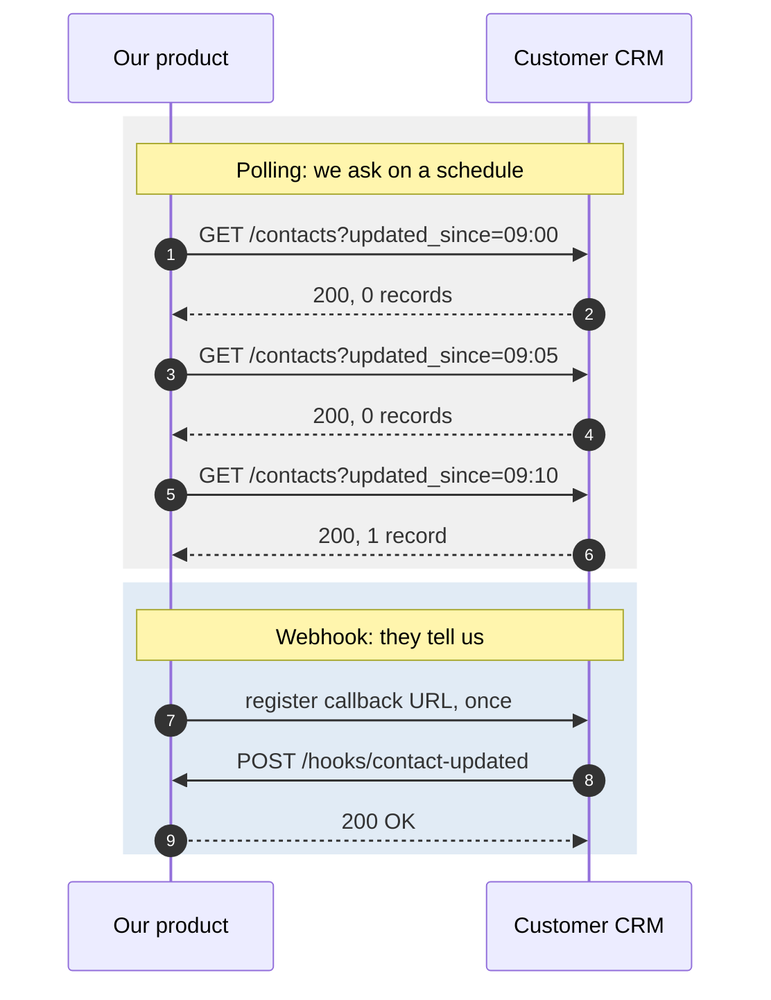
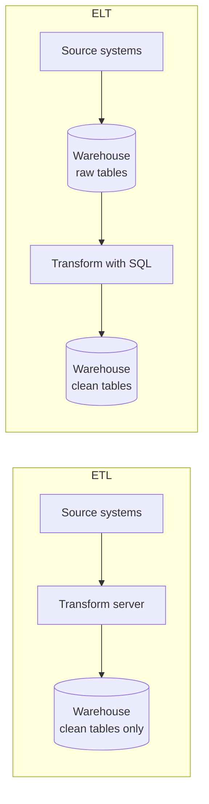
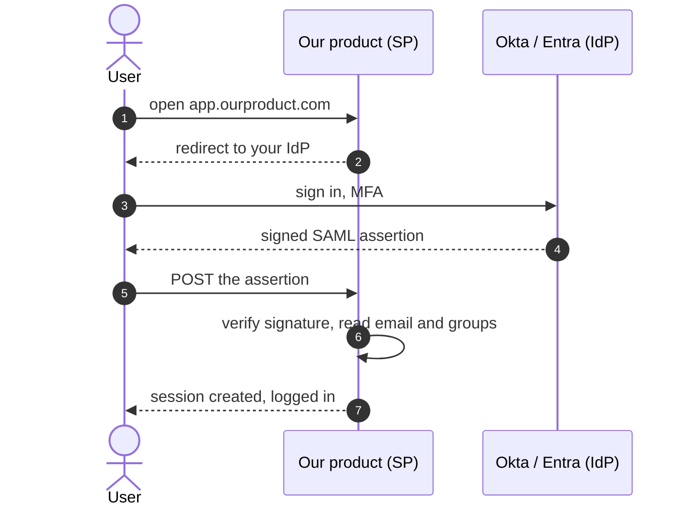
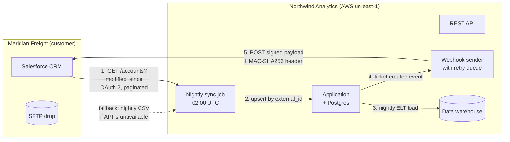

# 08. Integrations and architecture

## Why an SE needs this

The discovery call went well. Now the prospect's IT director joins the next
call with three questions: "How does your product get data out of our
Salesforce, where is it hosted, and do you support SAML?" Whoever answers
those clearly, in the customer's vocabulary, is the person the IT director
trusts for the rest of the deal. Later, after the contract is signed, an SE
writes the solution-design document that implementation follows — a diagram,
the data flows, the identity setup, and the assumptions. This module gives you
the vocabulary for the call and the shapes for the diagram.

## What you will be able to do

- Name the four ways two systems exchange data and say when each is right.
- Explain webhooks versus polling, including why webhooks need a retry story.
- Draw a system architecture in Mermaid that a customer's IT team would accept.
- Explain ETL and ELT and why the industry moved from one to the other.
- Answer "do you support SSO" with a real answer about SAML, OIDC, and SCIM.
- Say what "hosted on AWS in us-east-1" means and why a customer might object.
- Distinguish a transactional database from a data warehouse.
- Answer ten common security-questionnaire questions in plain language, and
  recognize the ones you must escalate rather than guess.

## Concepts

### The four integration patterns

| Pattern | How it works | Latency | Use when |
|---|---|---|---|
| **Batch file transfer** | One system drops a file on a server, the other picks it up on a schedule | Hours to a day | Large volumes, legacy systems, finance and HR data, nightly reconciliation |
| **API pull** | Your system asks their API on a schedule for what changed | Minutes to hours | You need control over timing, or the source has no push mechanism |
| **Webhook push** | Their system calls your URL the moment something happens | Seconds | Event-driven work: notify, trigger, sync a single record |
| **iPaaS / middleware** | A third-party platform sits between both and does the mapping | Varies | The customer has many systems and no engineering capacity |

Nearly every real integration is a combination: a nightly batch load for the
historical bulk, plus webhooks for changes since.

**SFTP** (SSH File Transfer Protocol) is the workhorse of batch. A file lands
in a directory, encrypted in transit, authenticated by key or password. It
sounds antique and it moves an enormous share of enterprise data because it is
simple, auditable, and every system supports it. Do not sneer at it on a call.

### Webhooks versus polling

**Polling** means asking repeatedly: "anything new?" A **webhook** is the
reverse — you register a URL with the other system, and it calls you when
something happens. Webhooks are sometimes called reverse APIs or callbacks.

| | Polling | Webhooks |
|---|---|---|
| Who initiates | The consumer | The producer |
| Freshness | As fresh as the interval | Near-instant |
| Wasted calls | Many empty responses | None |
| Needs a public URL | No | Yes, reachable from the internet |
| Failure mode | Miss a run, catch up next time | Miss a delivery, data is silently lost unless retried |
| Firewall friendly | Yes | Often blocked by enterprise IT |

Four things every webhook conversation must cover, and the questions to ask:

1. **Retries.** If our endpoint is down for ten minutes, do you retry, how many
   times, and with what backoff?
2. **Ordering.** Can events arrive out of order? Usually yes, which means the
   payload needs a timestamp or version you can compare.
3. **Duplicates.** Webhooks are **at-least-once** delivery, meaning the same
   event can arrive twice. The receiver must be **idempotent**: processing the
   same event ID twice has the same result as once.
4. **Verification.** How do we know a POST to our URL really came from you?
   The standard answer is a **signature**: the sender hashes the payload with a
   shared secret and puts the result in a header, and you recompute it. Without
   this, anyone who learns your URL can inject fake events.

If a vendor cannot answer those four, their webhooks are a demo feature, not
an integration.

### ETL and ELT

**ETL** is Extract, Transform, Load: pull data out, clean and reshape it on a
middle server, then load the finished result into the warehouse. **ELT** is
Extract, Load, Transform: pull the raw data, dump it into the warehouse as-is,
and transform it there with SQL.

ETL came first, when storage and compute were expensive and you could not
afford to keep raw data. ELT won because cloud warehouses made both cheap, and
because keeping the raw data means you can re-transform it when the definition
of "active customer" changes — which it will, twice a year, forever.

What this means on a call: when a customer says "we use Fivetran and dbt,"
they are describing ELT. Fivetran extracts and loads; dbt transforms with SQL
inside the warehouse.

**iPaaS** (Integration Platform as a Service) is hosted middleware with
prebuilt connectors and a visual builder. Zapier is the lightweight end, aimed
at individual users and simple triggers. Workato and Boomi sit in the middle,
aimed at operations teams. MuleSoft is the heavy
enterprise end, aimed at IT organizations managing hundreds of APIs. You are
not expected to configure these. You are expected to recognize the name and
ask "who maintains that integration today?"

### Identity: SSO, SAML, OIDC, SCIM

**SSO** (Single Sign-On) means a user signs in once to their company's
identity provider and gets into every connected application without a separate
password. The **IdP** (identity provider) is the customer's system — Okta,
Microsoft Entra ID, Google Workspace, Ping. The **SP** (service provider) is
your product.

The critical property: your product never sees the password. It receives a
signed statement from the IdP saying "this is priya@customer.com, and she is
in the Finance group."

| | SAML 2.0 | OIDC |
|---|---|---|
| Age | 2005, XML-based | 2014, JSON-based, built on OAuth 2 |
| Typical use | Enterprise web apps | Mobile apps, modern web, consumer login |
| The artifact | A signed XML **assertion** | A signed JSON **ID token** (a JWT) |
| Still required in enterprise deals | Yes, very often | Increasingly accepted |

**SCIM** (System for Cross-domain Identity Management) is the other half and
the one people forget. SSO handles login. SCIM handles **provisioning**:
automatically creating a user in your product when they are hired, updating
them when they change teams, and — the part security cares about —
**deprovisioning** them when they leave. Without SCIM, an employee who was
fired on Friday still has an account on Monday. Enterprise buyers ask about
this specifically.

The one-sentence answer to "do you support SSO": "Yes, SAML 2.0 with any
standard IdP, and SCIM for automated provisioning and deprovisioning."

### Cloud basics

**The cloud** is renting someone else's computers. Three providers hold most
of the market: **AWS** (Amazon), **Azure** (Microsoft), and **GCP** (Google).

Three resource types cover most conversations:

- **Compute**: rented servers that run your code. AWS calls them EC2
  instances; the container versions are ECS and EKS; the no-server-to-manage
  version is Lambda.
- **Storage**: somewhere to put files. AWS S3 is the reference example. Cheap,
  effectively unlimited, addressed by bucket and key.
- **Managed database**: a database the provider operates for you, handling
  backups, patching, and failover. AWS RDS for Postgres or MySQL, Aurora for
  the high-end version.

A **region** is a geographic cluster of data centers, such as `us-east-1`
(Northern Virginia), `eu-west-1` (Ireland), or `ap-southeast-1` (Singapore). An
**availability zone** is one isolated data center inside a region; running in
several zones is how a service survives one building's failure.

"We are hosted on AWS in us-east-1" means: our servers, databases, and file
storage physically live in Northern Virginia, on hardware Amazon operates. Two
implications a customer cares about. Latency: a user in Sydney is roughly 200
milliseconds away, which is noticeable in an interactive app. And **data
residency**: their data is in the United States, which may violate their own
policy or their regulator's rules. If a European customer asks "can our data
stay in the EU," you are being asked whether you have an EU region, and the
honest answer is a real answer with a date, not a maybe.

### Database versus data warehouse

| | Transactional database (OLTP) | Data warehouse (OLAP) |
|---|---|---|
| Purpose | Run the application | Answer questions across all the data |
| Typical query | Read or update one row | Aggregate millions of rows |
| Optimized for | Many small concurrent writes | Large scans and joins |
| Storage layout | Row-oriented | Column-oriented |
| Examples | Postgres, MySQL, SQL Server | Snowflake, BigQuery, Redshift, Databricks |
| Data age | Live, right now | Minutes to a day behind |

Why a company has both: running a heavy analytical query against the
production database slows the product down for every user. So data is copied
out on a schedule into the warehouse, where analysts can do whatever they
like. This is why the number in a customer's dashboard is sometimes a few
hours behind the number in the product, and being able to explain that gap
calmly is a real SE moment.

DuckDB, which you have been using, is a column-oriented analytical engine —
the same family as Snowflake, just running on your laptop instead of a
cluster.

### Security vocabulary

- **Encryption in transit**: data is encrypted while moving over the network.
  In practice, TLS 1.2 or higher, which is what the `s` in `https` means.
- **Encryption at rest**: data is encrypted while sitting on a disk. Typically
  AES-256. It protects against someone stealing the physical drive or a
  snapshot, not against a compromised application account.
- **RBAC** (Role-Based Access Control): permissions are attached to roles such
  as admin, member, or viewer, and users get roles. The alternative,
  per-user permissions, becomes unmanageable at scale.
- **Principle of least privilege**: every account gets the minimum access
  needed and nothing more. This is the reason a customer's API key returns 403
  on an endpoint their admin can use in the UI.
- **SOC 2**: an audit report on a vendor's security controls. Type I says the
  controls were designed properly at a point in time. Type II says an auditor
  observed them operating over a period, usually 3 to 12 months. Type II is
  the one enterprise buyers want. It is a report you send under NDA, not a
  certificate you post on a website.
- **ISO 27001**: an international certification for an information security
  management system. Common in European deals where SOC 2 is less familiar.
- **GDPR**: the EU regulation governing personal data. For an SE, the parts
  that come up are the right to deletion, the requirement to say where data is
  processed, and the **DPA** (Data Processing Agreement) that legal will need
  to sign.
- **Data residency**: the requirement that data physically stays in a
  particular country or region.
- **PII** (Personally Identifiable Information): data that identifies a person.
  Its presence changes which questions get asked about everything else.
- **Pen test** (penetration test): a hired security firm attempts to break in
  and writes up what they found. Customers ask for the summary, not the full
  report.

The rule that keeps you employed: **never guess on a security question.** The
correct answer to anything you are not certain of is "I want to give you an
accurate answer rather than a fast one — let me confirm with our security team
and come back to you by Thursday." Then actually come back by Thursday. A
guess that turns out to be wrong is discovered during legal review and costs
the deal and your credibility.

## Walkthrough

Draw the architecture for a real, common scenario.

**The scenario.** Northwind Analytics has signed a customer, Meridian Freight.
Meridian uses Salesforce as their CRM. They want two things: every night,
their account records should flow into Northwind so usage reports can be
grouped by account owner. And whenever a support ticket is created in
Northwind, a case should appear in Salesforce immediately.

That is one batch pull and one webhook push, in opposite directions. Here is
the diagram.

Mermaid renders directly on GitHub. Fence the block with three backticks and
the word `mermaid`.

Now the part that turns a picture into a solution design. Every arrow needs
answers to the same five questions, and this table is the actual deliverable.

| # | Flow | Direction | Trigger | Auth | Failure handling |
|---|---|---|---|---|---|
| 1 | Accounts | Salesforce to Northwind | Nightly 02:00 UTC | OAuth 2, refresh token stored in secrets manager | Retry 3 times with backoff, alert on-call, last successful watermark preserved so the next run catches up |
| 2 | Upsert | Internal | After each page | Internal | Matched on `external_id`; unmatched rows go to a quarantine table for review, never silently dropped |
| 3 | ELT load | Internal | Nightly 03:00 UTC | Internal | Idempotent full reload of the previous day |
| 4 | Ticket event | Internal | On ticket create | Internal | Queued, so a slow customer endpoint never blocks the product |
| 5 | Case creation | Northwind to Salesforce | Within seconds | HMAC-SHA256 signature, secret shared at setup | At-least-once with exponential backoff for 24 hours, dead-letter queue after; Salesforce side must be idempotent on our `event_id` |

Three design decisions worth being able to defend out loud:

- **Why nightly rather than real-time for accounts.** Account records change
  rarely and the reports that use them run daily. Real-time sync would add
  cost and failure modes for no user-visible benefit. Match the freshness to
  the decision it supports.
- **Why the SFTP fallback exists.** Enterprise customers get API access
  revoked by their own IT more often than you would think. A documented
  fallback keeps the integration alive during a change freeze.
- **Why the webhook is queued.** If Meridian's endpoint is slow, an inline
  call would make ticket creation slow inside your own product. Queueing keeps
  the customer's problem on the customer's side of the boundary.

Do it yourself now: open `templates/architecture-diagram-template.md`, copy
the structure, and redraw this diagram for a different scenario — a customer
whose HR system needs to provision users into your product via SCIM, and who
exports usage data to their own warehouse weekly. Push it to your learning-log
repository and confirm it renders on GitHub.

## Exercises

Answers in `solutions.md`. Exercise 1 is the big one; do it in writing, in
full sentences, as though it were going to a real customer.

1. Answer these ten security-questionnaire questions in plain language, as an
   SE would in a written response. For any you cannot answer without checking,
   say exactly who you would ask and what you would ask them.

   1. Where is our data physically stored, and can it be kept in the EU?
   2. Is data encrypted in transit and at rest? Specify the standards.
   3. Do you support SAML 2.0 single sign-on, and with which identity
      providers?
   4. How are user permissions managed within the application?
   5. Do you have a SOC 2 Type II report, and when was it last issued?
   6. Who at your company can access our production data, and under what
      circumstances?
   7. How quickly is a user's access removed when they leave our company?
   8. What is your data retention policy, and how do we request deletion of
      our data?
   9. Do you use subprocessors, and can we see the list?
   10. What is your incident response process and notification timeline for a
       breach?

2. A prospect says: "We need our support tickets in Slack within a minute of
   creation." Choose an integration pattern, justify it in three sentences,
   and name the two failure modes you would ask about before promising it.

3. Draw, in Mermaid, the flow for a customer whose data warehouse (Snowflake)
   needs a daily copy of your product's usage data. Include the trigger, the
   direction, and where transformation happens. Label whether it is ETL or
   ELT and say why.

4. Explain to a non-technical buyer, in under 100 words, why their dashboard
   number does not match the number in the product UI right now.

5. A customer's IT director asks: "If we turn on SSO, what happens to the
   twelve users who already have passwords in your system?" Write your answer,
   and name the two follow-up questions you need to ask them.

6. Compare polling and webhooks for a customer whose network security team
   will not allow inbound connections from the internet. What do you
   recommend, and what do you lose?

7. Read your own product's documentation — or, if you have no product yet,
   Stripe's webhook documentation — and write down its answers to the four
   webhook questions from the Concepts section: retries, ordering, duplicates,
   verification.

8. A customer asks whether they can host your product in their own data
   center. Write the three questions you would ask before answering, and
   explain in two sentences why "yes" is an expensive answer for a SaaS
   company.

## Checkpoint

1. A customer's webhook endpoint was down for two hours. What are the three things you need to know to tell them whether they lost data?

First, does the sender retry, and for how long? At-least-once delivery with
24 hours of exponential backoff means nothing was lost; fire-and-forget means
everything in that window was. Second, is there a dead-letter queue or an
event log we can replay from? Third, is there a pull-based backfill endpoint,
so they can fetch everything that changed in that window and reconcile. If the
answer to all three is no, the honest statement is "you lost two hours of
events and here is the manual reconciliation path."

2. What is the difference between SSO and SCIM, and why does a security team care about the second one specifically?

SSO handles authentication — proving who a user is at login, without your
product ever seeing a password. SCIM handles provisioning — creating,
updating, and deactivating the user account itself. Security teams care about
SCIM because SSO alone does not remove access. When an employee leaves, SSO
stops them logging in through the IdP, but any local password or API token in
your product may still work. SCIM deprovisioning closes that gap
automatically, which is what an auditor asks for evidence of.

3. Why did the industry move from ETL to ELT?

Cloud warehouses made storage and compute cheap and elastic, so there was no
longer a reason to transform data on a separate server before loading it.
Loading raw first has a second, larger benefit: when a business definition
changes — and definitions like "active customer" change constantly — you can
re-run the transformation over history you still have. Under ETL, data that
did not survive the transform was gone, so a definition change meant
re-extracting from source systems, if that was even possible.

4. A European prospect says their data cannot leave the EU. Your product runs only in us-east-1. What do you say?

Say what is true and specific: "Today we run in AWS us-east-1, in Northern
Virginia, so your data would be processed in the United States. We handle
transfers under standard contractual clauses and our DPA covers it, and I can
send both to your legal team. If EU-only residency is a hard requirement
rather than a preference, I want to be straight with you about our roadmap
rather than guess — let me get you a firm answer on an EU region and a date."
Then find out whether it is a hard requirement, because that determines
whether this is a deal or not, and the AE needs to know today.

5. Name the four integration patterns and give one scenario where each is the right choice.

Batch file transfer over SFTP: nightly payroll or finance reconciliation,
where volumes are large, timing is fixed, and the source is a legacy system.
API pull: syncing a CRM's accounts on a schedule when you want control over
timing and the source has no push. Webhook push: notifying a customer's Slack
or ticketing system within seconds of an event. iPaaS: a mid-market customer
with eight SaaS tools, no engineering team, and an operations lead who will
maintain the connection in a visual builder.

You can now say:

- "I can scope an integration: I know when to use batch, API polling, or
  webhooks, and I ask about retries, ordering, duplicates, and signature
  verification before committing to a design."
- "I can produce a solution-design diagram with the data flows, triggers,
  authentication, and failure handling labelled, and walk a customer's IT team
  through it."
- "I can handle a security questionnaire on SSO, SAML, SCIM, encryption, and
  data residency, and I know which questions to escalate instead of guessing."

## Put it on your résumé

- Produced solution-design documentation including Mermaid architecture
  diagrams covering data flows, triggers, authentication methods, and failure
  handling for batch, API, and webhook integration patterns.
- Responded to security and architecture questions covering SAML SSO, SCIM
  provisioning, encryption in transit and at rest, and data residency,
  escalating items requiring security-team verification.

## Go deeper

- [Okta: SAML versus OIDC](https://www.okta.com/identity-101/) — Okta's
  identity-101 library is vendor-written but genuinely the clearest free
  explanation of SAML, OIDC, SCIM, and MFA at exactly this depth.
- [Stripe webhooks documentation](https://docs.stripe.com/webhooks) — the
  reference implementation. Read how they document retries, signature
  verification, and idempotency, then hold every other vendor to it.
- [AWS global infrastructure](https://aws.amazon.com/about-aws/global-infrastructure/) —
  the actual region map. Use it when a customer names a residency requirement
  so you are talking about real places.
- [Mermaid live editor](https://mermaid.live) — paste and render diagrams
  instantly. Build the diagram here, then paste it into the README.
- [Fivetran: ETL versus ELT](https://www.fivetran.com/learn/etl-vs-elt) — a
  short, clear framing from a vendor whose whole business is the distinction.
  Read it knowing that, and it is still the best free explainer.
