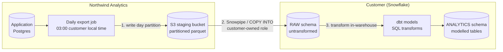

# 08. Solutions

These are model answers for a fictional product, Northwind Analytics, hosted
on AWS in `us-east-1`. When you do this for a real employer, every factual
claim comes from your security team or your trust center, never from memory.

## 1. The ten security-questionnaire answers

The format matters as much as the content. A good written answer is: the
direct answer first, then the specific detail, then the evidence you can
provide. No hedging, no marketing language, and an explicit "I will confirm"
where you are not certain.

**1. Where is our data physically stored, and can it be kept in the EU?**

All customer data is stored in AWS `us-east-1`, in Northern Virginia, United
States. Today we do not offer an EU-resident deployment. Transfers of EU
personal data are covered by the standard contractual clauses in our Data
Processing Agreement, which I can send to your legal team. If EU-only
residency is a contractual requirement rather than a preference, tell me now
and I will get you a firm roadmap answer with a date from our VP of
Engineering rather than a maybe.

**2. Is data encrypted in transit and at rest? Specify the standards.**

Yes to both. In transit, TLS 1.2 or higher on every connection, including
internal service-to-service traffic. At rest, AES-256 on all databases,
backups, and object storage, using AWS KMS-managed keys. Customer-managed
encryption keys are not available today. Escalate to confirm: whether the KMS
keys are per-tenant or shared, because enterprise reviewers ask and getting
that wrong is worse than saying "let me check."

**3. Do you support SAML 2.0 single sign-on, and with which identity
providers?**

Yes, SAML 2.0 with any standards-compliant identity provider. We have
documented setup guides for Okta, Microsoft Entra ID, Google Workspace, and
Ping Identity, and customers have connected others using the generic SAML
configuration. We also support SCIM 2.0 for automated user provisioning and
deprovisioning. SSO is available on the Enterprise plan.

**4. How are user permissions managed within the application?**

Role-based access control. Every user holds one role — admin, member, or
viewer — and permissions attach to the role rather than the individual.
Admins manage roles inside the application, or you can map them from your IdP
group memberships through the SAML assertion so that role changes happen in
your directory rather than ours. All permission changes are written to an
audit log that admins can export.

**5. Do you have a SOC 2 Type II report, and when was it last issued?**

Yes. Our most recent SOC 2 Type II report covers a twelve-month observation
period and is available under a mutual NDA. I will confirm the exact report
period and issue date with our compliance team today and send the report and
the bridge letter alongside this response. Do not quote a date from memory:
questionnaire responses get attached to contracts.

**6. Who at your company can access our production data, and under what
circumstances?**

Access to production is limited to a named on-call engineering group under the
principle of least privilege. Access requires an approved ticket tied to an
incident or a customer support request, is granted for a limited time, and is
logged. Support staff do not have standing access to customer data. Escalate
to confirm: whether "impersonate user" exists as a support tool, whether it
requires customer consent, and whether it is logged. This is a question
customers follow up on, and a vague answer here reads as evasion.

**7. How quickly is a user's access removed when they leave our company?**

With SCIM enabled, deactivation in your identity provider propagates to us
within minutes and immediately terminates active sessions. Without SCIM,
removal depends on your admin deleting the user in our application, so the
timeline is whatever your offboarding process is. This is the strongest
practical argument for enabling SCIM, and it is worth saying plainly rather
than selling it.

**8. What is your data retention policy, and how do we request deletion of
our data?**

While your subscription is active we retain your data indefinitely so it
remains available to you. On termination, data is retained for 30 days to
allow export, then deleted from production; encrypted backups age out on a
further 35-day cycle, so full deletion completes within approximately 65 days.
You can request deletion of specific records at any time through your admin or
by contacting support, and we action verified deletion requests within 30 days
to meet GDPR requirements. Escalate to confirm the exact backup retention
window before sending.

**9. Do you use subprocessors, and can we see the list?**

Yes. Our current subprocessors include AWS for hosting, and named vendors for
email delivery, error monitoring, and product analytics. The complete list,
with each subprocessor's purpose and location, is published on our trust page
and incorporated into the DPA. We notify customers before adding a new
subprocessor, and the DPA gives you a window to object.

**10. What is your incident response process and notification timeline for a
breach?**

We maintain a documented incident response plan with defined severity levels,
an on-call rotation, and a designated incident commander. For a confirmed
security incident affecting your data, our DPA commits us to notify you
without undue delay and within 72 hours of confirmation, with the nature of
the incident, the data categories affected, and the remediation steps. We run
tabletop exercises against this plan. Escalate to confirm the exact
contractual notification window in your current DPA, because it varies by
contract and legal will hold you to what you wrote.

The pattern across all ten: four you can answer outright, four you answer with
a specific detail you should verify once, and two (5 and 10) where the answer
is a document rather than a sentence. Escalating two of ten is not weakness —
it is the correct ratio, and it is what an experienced SE does.

## 2. Tickets in Slack within a minute

Webhook push. Slack's inbound webhooks accept an HTTP POST and post the
message immediately, so a one-minute target is comfortably met without polling
overhead; polling frequently enough to hit one minute would mean 1,440 calls a
day, almost all of them empty. Slack is a cloud service with a public endpoint,
so the usual enterprise objection about inbound connections through a firewall
does not apply.

The two failure modes to ask about before promising it:

1. **Delivery failure.** If Slack returns a 5xx or we time out, does our
   webhook sender retry, and for how long? If it is fire-and-forget, an
   outage silently loses notifications, and the customer discovers the gap
   when someone misses an urgent ticket.
2. **Rate limiting.** Slack rate-limits inbound webhooks. If the customer
   creates 400 tickets in an hour during an incident — exactly when they care
   most — do we get 429s, and does the sender back off or drop? Ask what
   their peak ticket volume looks like, not their average.

## 3. Daily copy into Snowflake

This is **ELT**. The data is extracted and loaded into Snowflake's `RAW`
schema untransformed; all reshaping happens afterwards, inside the warehouse,
in SQL.

Why ELT is right here specifically: the customer owns the transformations and
their definitions will change. If a customer decides next quarter that "active
user" means 5 sessions rather than 1, they re-run their dbt models over the
raw history they already hold. Under ETL, that definition change would require
us to re-export historical data, which turns a customer's ten-minute change
into a support ticket and a two-week wait.

The other reason, worth naming on a call: the transformation logic stays on
the customer's side of the boundary, so their analytics team is not blocked on
your release cycle.

## 4. Why the dashboard does not match the product

Under 100 words, no jargon:

"The product screen reads from the live system, so it shows this second. Your
dashboard reads from a reporting copy that is refreshed on a schedule — last
night at 2am, in your case. That copy exists on purpose: running big reports
against the live system would slow the product down for everyone using it. So
the two numbers will differ by whatever has happened since the last refresh.
If you need them closer together, we can increase the refresh frequency, and I
can tell you what that costs before you decide."

Note the shape: what is true, why it is designed that way, and what the
customer can do about it. Never open with "that's expected behaviour."

## 5. Turning on SSO with twelve existing password users

"When SSO is enabled, those twelve users keep their accounts, their data, and
their permissions. What changes is how they get in: instead of a password
prompt they will be redirected to your identity provider. The match is made on
email address, so as long as the email in our system matches the email your
IdP sends, each person lands in their existing account rather than a new,
empty one. We will export the list of the twelve current emails before we
switch, so you can confirm every one exists in your IdP first."

Two follow-up questions you must ask:

1. **Do you want to enforce SSO or allow both?** Enforcing it disables
   password login entirely, which is what security teams want, but it locks
   out anyone not yet in the IdP — including contractors and any shared
   service account. Allowing both is a softer migration and leaves the
   password backdoor open, which they will be asked about at their next audit.
2. **Do any of the twelve emails differ from their IdP identity?** Someone who
   signed up as `p.raman@` when the directory says `priya.raman@` will get a
   brand-new empty account on first SSO login. Reconciling that afterwards is
   painful, so you check the list before the switch, not after.

## 6. No inbound connections allowed

Recommend **polling**, run from the customer's side. Their network security
team is refusing to open an inbound path from the internet, which rules out
webhooks entirely: a webhook requires a publicly reachable URL on their
network. Polling reverses the direction — their system makes an outbound call
to your API, and outbound HTTPS is almost always permitted.

What you lose:

- **Latency.** Freshness is now bounded by the polling interval. Five-minute
  polling means up to five minutes of delay, and there is no way around it
  without more frequent calls.
- **Efficiency.** Most polls return nothing, so you burn API quota and their
  compute on empty responses. Watch the rate limit if the interval is short.
- **Event fidelity.** Polling shows you state, not events. If a record changes
  twice between polls you see only the final state. That matters if the
  customer's process cares about the intermediate change, for example a ticket
  that was escalated and then de-escalated.

The middle path worth offering: an events endpoint on your side that they poll
(`GET /events?since=<cursor>`), returning the individual changes rather than
current state. That recovers event fidelity while keeping the connection
outbound, and it is a genuinely credible thing to propose on a call.

## 7. Stripe's webhook documentation, against the four questions

| Question | Stripe's answer |
|---|---|
| Retries | Yes. Live-mode events are retried with exponential backoff for up to about three days. Endpoints that fail continuously are eventually disabled, with an email warning first |
| Ordering | Not guaranteed. Stripe states events may arrive out of order and recommends fetching the current object state from the API rather than trusting sequence |
| Duplicates | At-least-once delivery, so duplicates are possible. Stripe tells you to make the handler idempotent, keyed on the event `id` |
| Verification | A `Stripe-Signature` header containing a timestamp and an HMAC-SHA256 signature over the raw request body, computed with your endpoint's signing secret. Their libraries expose `constructEvent` to verify it, and the raw body must be used, not the parsed JSON |

Two details worth stealing when you evaluate any vendor. Stripe returns to
sender: they tell you to re-fetch the object rather than trust the payload,
which sidesteps ordering entirely. And they use the raw body for signature
verification, because parsing and re-serializing JSON changes the bytes and
breaks the hash — a bug that costs teams a full day the first time.

## 8. Can we host it ourselves

The three questions to ask first:

1. **What is driving the requirement?** Usually it is one of three things:
   data residency, a policy that forbids third-party SaaS for a specific data
   class, or an air-gapped network. Each has a different answer, and residency
   in particular is often solvable with a regional deployment rather than
   self-hosting.
2. **Who would operate it?** Do they have a platform team that runs
   containerized applications today, and are they prepared to own upgrades,
   backups, and monitoring? If the answer is "our two-person IT team," the
   deployment will fail and it will read as your product failing.
3. **How would support and upgrades work?** If we cannot see logs or reproduce
   an issue, every support interaction becomes a screen-share. Ask whether
   they will permit diagnostic telemetry.

Why "yes" is expensive for a SaaS company, in two sentences: every self-hosted
customer freezes a version of the product in an environment you cannot see,
so you end up supporting many versions at once instead of one, and every bug
fix must be backported and shipped rather than deployed. It also breaks the
economics — multi-tenant SaaS is profitable because one deployment serves
every customer, and a single-tenant install replaces that with per-customer
engineering effort that never ends.
