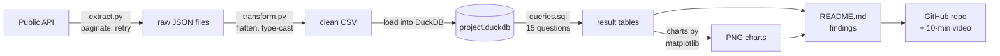

# 09. Capstone pipeline

## Why an SE needs this

You will be asked, in an interview, "tell me about something technical you
built." Right now the honest answer is a list of things you have learned. By
the end of this module it is a URL: a public repository containing a script
that pulls real data from an API, a database of that data, fifteen analytical
queries, a set of charts, a README that explains the decisions, and a
ten-minute video of you walking through it. That artifact does three jobs at
once. It proves you can do the work, it gives you something concrete to talk
about for twenty minutes, and — this is the part people miss — recording the
walkthrough *is* practising the demo, which is the actual skill the job tests.

## What you will be able to do

- Pick a project in fifteen minutes instead of two weeks.
- Pull real data from a public API into a local database, end to end.
- Write fifteen analytical queries that answer questions a person would ask.
- Produce charts from query results without a paid tool.
- Write a project README that a hiring manager can read in ninety seconds.
- Publish to GitHub and record a ten-minute walkthrough of your own work.
- Grade your own project against a rubric before anyone else does.

## Concepts

### What makes a portfolio project count

Most portfolio projects fail for the same three reasons, and all three are
avoidable.

| Failure | What it looks like | Fix |
|---|---|---|
| No question | "I loaded some data and made a bar chart" | Decide the three questions before you write any code. Put them at the top of the README |
| No decisions | Every step is the tutorial's default | Write down one thing you chose and one thing you rejected, and why |
| No finish | Half-built, no README, last commit three months ago | Ship a small, complete thing. Complete beats ambitious |

The thing being assessed is not the difficulty of the code. It is whether you
can take a vague business question, get data, answer it, and explain the
answer. That is a description of the SE job.

### The three project ideas

All three use free APIs with no signup. Pick one. Do not design a fourth.

**Idea A: The 311 complaint pipeline.** NYC's 311 service is a public support
desk: residents report a problem, an agency owns it, it gets resolved or it
does not. It is structurally identical to a SaaS support queue, which makes
every query you write directly relevant to a support or CS conversation.

- API: NYC Open Data (Socrata SODA 2.0),
  `https://data.cityofnewyork.us/resource/erm2-nwe9.json`
- No key required. An app token is optional and only raises throughput.
- Paginate with `$limit` and `$offset`, filter with `$where`.
- Real fields: `unique_key`, `created_date`, `closed_date`, `agency`,
  `complaint_type`, `descriptor`, `status`, `borough`, `incident_zip`.
- Questions it answers: which complaint types take longest to close, which
  boroughs are underserved, how volume moves by season and day of week, which
  agencies have the largest open backlog.
- Best if you want the project that most resembles the job.

**Idea B: The open-source support backlog.** A large open-source project's
issue tracker is a real engineering backlog with labels, ages, and
contributors.

- API: GitHub REST,
  `https://api.github.com/repos/{owner}/{repo}/issues`
- No key required at 60 requests per hour; a free personal access token raises
  that to 5,000, which you will want.
- Paginate with `per_page` and `page`, or follow the `Link` header.
- Real fields: `number`, `title`, `state`, `created_at`, `closed_at`, `labels`,
  `user.login`, `comments`, `pull_request`.
- Questions it answers: median time to close by label, how the backlog has
  grown, which labels correlate with long resolution, contributor
  concentration.
- Best if you want to practise pagination, rate limits, and nested JSON, since
  `labels` is an array of objects inside each record.

**Idea C: The market-context dataset.** World Bank indicators give you the
same metric across many countries and years, which is the shape of every
market-sizing question a sales team asks.

- API: World Bank Indicators,
  `https://api.worldbank.org/v2/country/{codes}/indicator/{indicator}?format=json`
- No key required. Pagination is `page` and `per_page`, and the response tells
  you `pages` and `total`.
- The response is an array whose first element is metadata and whose second
  element is the array of records. That is unusual and worth handling
  deliberately.
- Questions it answers: which markets grew fastest over ten years, how
  internet penetration tracks GDP per capita, which regions to prioritize.
- Best if you want a project that sounds commercial in an interview.

### Picking in fifteen minutes

Set a timer. Genuinely.

1. Minutes 0 to 5: read the three descriptions above and open each API's
   documentation.
2. Minutes 5 to 12: make one request to each with curl or Postman. Confirm you
   get 200 and JSON back.
3. Minutes 12 to 15: pick the one whose data you find least boring, and write
   your three questions into a file. Commit that file.

Once the timer ends, the decision is final. Switching projects later is the
single most common way this module gets abandoned. The dataset does not
determine whether the project impresses anyone; the finish does.

### The shape of the pipeline



Three separate scripts, not one. Keeping extract separate from transform means
that when the transform has a bug — and it will — you fix it and re-run
against the raw files you already saved, instead of hammering the API again.
That separation is also exactly how a real data pipeline is built, and saying
"I kept extraction and transformation separate so I could re-run transforms
without re-hitting the API" is a genuinely senior-sounding sentence.

### Choosing a dashboard tool

| Option | Cost | Effort | When to pick it |
|---|---|---|---|
| **matplotlib PNGs** (default) | Free | Low | You want charts in the README with zero setup. Start here |
| **Tableau Public** | Free | Medium | You want an interactive, linkable dashboard on your résumé |
| **Metabase via Docker** | Free | High | You already have Docker working and want to say you stood up a BI tool |

Start with matplotlib. Four PNG charts committed to the repository and
embedded in the README beat an interactive dashboard that does not exist. If
you finish early, add Tableau Public and link it. Metabase is optional and
nothing in this module depends on it.

## Walkthrough

Eight steps with a checkpoint after each. A checkpoint means: something works,
and you commit it. Estimated total time is 10 to 14 hours, which fits a week
of 90-minute sessions with room to spare.

Create the repository first. This is a new, separate repository from your
learning log, because you will link to it directly.

```bash
mkdir se-capstone
cd se-capstone
git init
python -m venv .venv
```

PowerShell activates the environment with `.venv\Scripts\Activate.ps1`; Git
Bash and macOS use `source .venv/bin/activate`.

```bash
pip install requests duckdb matplotlib
pip freeze > requirements.txt
```

Add a `.gitignore` containing `.venv/`, `__pycache__/`, `*.duckdb`, and
`data/raw/`. Raw API dumps do not belong in Git.

### Step 1: three questions, written down

Create `README.md` with a title, one paragraph on what the project is, and the
three questions you are answering. Write them as a person would ask them, not
as column names. "Which complaint types take longest to resolve, and has that
changed since 2024?" is a question. "Analyze closed_date" is not.

**Checkpoint 1.** `README.md` exists with three questions in it, and is
committed. This takes twenty minutes and it is the step people skip.

### Step 2: one successful API call

Write `extract.py` so that it makes exactly one request and prints the status
code and the first record. Nothing else yet.

```python
import requests

response = requests.get(
    "https://data.cityofnewyork.us/resource/erm2-nwe9.json",
    params={"$limit": 2, "$where": "created_date > '2026-01-01T00:00:00'"},
    timeout=30,
)
print(response.status_code)
print(response.json()[0])
```

Real output from that request on 2026-09-07 begins:

```json
{
  "unique_key": "70308126",
  "created_date": "2026-09-06T02:06:20.000",
  "agency": "TLC",
  "agency_name": "Taxi and Limousine Commission",
  "complaint_type": "For Hire Vehicle Complaint",
  "descriptor": "Car Service Company Complaint",
  "status": "In Progress",
  "borough": "QUEENS",
  "incident_zip": "11430"
}
```

**Checkpoint 2.** You have a 200 and a real record printed to your terminal.

### Step 3: pagination and saving raw data

Extend `extract.py` to loop until it has 20,000 to 50,000 records, writing
each page to `data/raw/page_0001.json` as it goes. Requirements:

- Stop when a page comes back empty, not when a counter hits a guess.
- Check `response.status_code` inside the loop and stop cleanly on a non-200.
- Sleep briefly between pages. Be a good citizen on a free public API.
- Print progress so you can see it working.

Aim for a volume that makes aggregates meaningful. Under 5,000 rows, every
average is noise.

**Checkpoint 3.** `data/raw/` holds many JSON files and the script printed a
total. Commit the script, not the data.

### Step 4: flatten to a clean CSV

Write `transform.py` that reads every file in `data/raw/`, flattens each
record to the ten to fifteen fields you actually need, and writes one
`data/clean.csv`.

This is where the real work is. Expect all of these:

- Missing keys on some records. Use `.get()`, and count how many were missing.
- Nested values, such as GitHub's `user.login` or World Bank's
  `country.value`. Reach in explicitly.
- Arrays, such as GitHub's `labels`. Decide: take the first, join them with a
  pipe character, or write a second CSV that is one row per label. Write down
  which you chose and why — that is a modelling decision from module 05.
- Dates as strings in inconsistent formats.
- Duplicate records across page boundaries. Deduplicate on the ID field and
  report how many you dropped.

Print a summary at the end: records in, records out, records dropped, and why.
This summary is a bullet in your README.

**Checkpoint 4.** `data/clean.csv` opens in Excel and every column is what its
name says it is.

### Step 5: load into DuckDB and sanity-check

```python
import duckdb

con = duckdb.connect("project.duckdb")
con.execute("""
    CREATE OR REPLACE TABLE complaints AS
    SELECT * FROM read_csv_auto('data/clean.csv')
""")
print(con.sql("SELECT count(*) FROM complaints").fetchall())
print(con.sql("SUMMARIZE complaints").fetchall())
```

`SUMMARIZE` is a DuckDB command that returns, for every column, the type, the
number of nulls, the number of distinct values, and the min and max. Read it
carefully. This is where you find that a date column loaded as text, or that
one column is 97 percent null and cannot support a question you planned.

**Checkpoint 5.** Row count matches your transform's output, and you have read
the `SUMMARIZE` output line by line.

### Step 6: fifteen queries

Write `queries.sql`. Every query gets a comment above it stating the question
in English. Use `modules/09-capstone-pipeline/example_queries.sql` in this
repository as the model — it contains fifteen queries against the repo dataset
covering exactly the range you need, and every one of them has been executed
and returns rows.

Cover this range, which maps to modules 03 and 04:

| Count | Type | Example |
|---|---|---|
| 3 | Aggregate and group | Volume by category, by month, by region |
| 3 | Join across two tables or a lookup | Complaints joined to agency names |
| 2 | Date arithmetic | Average hours to close, by category |
| 2 | CTE with a filter on the aggregate | Categories above the overall average |
| 2 | Window function | Rank within group, month-over-month change with `LAG` |
| 2 | Missing-data handling | What share has no close date, and what that does to your averages |
| 1 | The surprising one | Whatever the data told you that you did not expect |

That last row is the one that matters in an interview. Every project has three
obvious findings and one interesting one. Find the interesting one and lead
with it.

**Checkpoint 6.** Fifteen queries, each returning rows, each with its question
written above it. Committed.

### Step 7: four charts

Write `charts.py` that runs four of your queries and saves four PNGs to
`charts/`.

```python
import duckdb
import matplotlib
matplotlib.use("Agg")          # write files, do not open a window
import matplotlib.pyplot as plt

con = duckdb.connect("project.duckdb")
rows = con.sql("""
    SELECT complaint_type, count(*) AS n
    FROM complaints
    GROUP BY complaint_type
    ORDER BY n DESC
    LIMIT 10
""").fetchall()

labels = [r[0] for r in rows]
values = [r[1] for r in rows]

fig, ax = plt.subplots(figsize=(9, 5))
ax.barh(labels[::-1], values[::-1])
ax.set_title("Top 10 complaint types, 2026")
ax.set_xlabel("Complaints")
fig.tight_layout()
fig.savefig("charts/top_complaint_types.png", dpi=150)
```

`matplotlib.use("Agg")` before importing `pyplot` tells matplotlib to write
files instead of trying to open a window, which is what you want in a script.

Four charts: one ranking, one time series, one comparison across a category,
and one showing the finding from the last row of step 6. Title every chart and
label every axis with units. An unlabelled axis is the fastest way to look
careless.

**Checkpoint 7.** Four PNGs in `charts/`, committed, each readable on its own
without explanation.

### Step 8: README, publish, record

Rewrite `README.md` using `templates/project-readme-template.md`. It must
contain, in this order:

1. One sentence on what this is.
2. The three questions.
3. The three findings, with a number in each, and the charts embedded.
4. How to run it: the exact commands, in order, from a clean clone.
5. The data: source, API, date range, row count, and known limitations.
6. Decisions and trade-offs: two or three, each one sentence.
7. What you would do next with more time.

Section 5 is where you say "13 percent of records had no close date, so
resolution-time averages exclude them." Stating a limitation makes every other
number more credible, not less.

Then publish:

```bash
git add .
git commit -m "Add capstone pipeline: extract, transform, queries, charts"
gh repo create se-capstone --public --source=. --push
```

Or create the repository in the GitHub web interface and follow its
instructions. Confirm the README renders and the charts display.

Finally, record a ten-minute walkthrough. Use the structure from
`templates/demo-script-template.md`. Loom's free tier, OBS, or the Windows
Game Bar (`Win+G`) all work. The structure:

| Minutes | Content |
|---|---|
| 0:00 to 1:00 | The question and why anyone would care |
| 1:00 to 3:00 | The finding, up front, with the chart on screen |
| 3:00 to 6:00 | How the data got there: the three scripts, briefly |
| 6:00 to 8:30 | One query, live, explained line by line |
| 8:30 to 10:00 | Limitations and what you would do next |

Lead with the finding, not the architecture. That is the tell-show-tell
structure from module 10, and this recording is your first rep at it.

**Checkpoint 8.** A public GitHub URL and a video link, both of which you have
opened in a private browser window to confirm a stranger can see them.

### The rubric

Score yourself honestly before showing anyone. Two points for fully met, one
for partial, zero for missing.

| # | Criterion | 2 points means |
|---|---|---|
| 1 | Questions stated | Three specific questions at the top of the README, phrased as a person would ask them |
| 2 | Data volume | Over 5,000 rows, so aggregates are meaningful |
| 3 | Extraction is robust | Handles pagination, checks status codes, stops cleanly, does not depend on a hard-coded page count |
| 4 | Transform is honest | Reports records in, out, and dropped, and handles missing fields without crashing |
| 5 | Query range | Fifteen queries covering aggregates, joins, dates, CTEs, and at least one window function |
| 6 | Queries are questions | Every query has the English question written above it |
| 7 | Findings, not output | The README states three findings with numbers, not a list of what the code does |
| 8 | Charts are readable | Four charts, each titled, axes labelled with units, understandable without the README |
| 9 | Reproducible | A stranger can clone it and run it from your instructions alone, with `requirements.txt` present |
| 10 | Limitations stated | At least two honest limitations named in the README |
| 11 | Decisions explained | Two or three trade-offs written down with reasoning |
| 12 | Commit history | More than one commit, with messages that describe what changed |
| 13 | Video exists | Ten minutes, leads with the finding, one query explained live |
| 14 | You can defend it | You can answer "why did you do it that way" for any file in the repository |

Scoring: 24 or above is résumé-ready and interview-ready. 18 to 23 is
publishable; fix the zeros before you link it. Below 18, do not link it yet —
find the two or three criteria scoring zero and spend one more session on
them. Almost always they are 7, 10, and 13, because those are the ones that
feel optional and are not.

## Exercises

These are checks on the capstone itself. Solutions in `solutions.md`.

1. Run `example_queries.sql` in this folder against the repo dataset. Pick any
   three results and write one sentence of interpretation for each — not what
   the query does, what the number means for the business.

2. Query 3 in that file reports churn rate by plan. The Free plan shows the
   highest rate. Write two sentences explaining why that number is
   uninteresting as stated, and rewrite the question so the answer would be
   useful to a CS team.

3. Query 6 finds accounts with an active subscription and no usage in 60 days.
   Change it to 30 days and note how the count changes. Then explain why you
   would not present the 30-day version to an executive without also showing
   the 60-day version.

4. Write the three questions for your own capstone. Then, for each one, write
   the shape of the query that would answer it — which table, which
   aggregate, which grouping — before you have any data.

5. Make one successful call to your chosen API and paste the first record.
   Identify every field you will keep and every field you will drop, and say
   why for two of the dropped ones.

6. Write the pagination loop for your API. Then answer in writing: how does it
   stop, what happens if page 7 returns 429, and how many records do you
   expect in total?

7. After your transform runs, report records in, records out, and records
   dropped. If those numbers are equal, explain how you verified there were
   genuinely no duplicates and no malformed records, rather than assuming it.

8. Score your finished project against the rubric. For every criterion where
   you scored 0 or 1, write the specific next action and how long it will
   take. This list is your finishing plan.

## Checkpoint

<details>
<summary>1. Why keep extraction and transformation in separate scripts?</summary>

So that fixing a transform bug does not mean re-downloading the data. Raw API
responses are saved once; the transform runs over them as many times as needed
and costs nothing. It also means your transform is testable and repeatable,
that you are not burning rate limit on iteration, and that if the API changes
or goes away you still have the raw data you collected. This is the same
argument as ELT versus ETL from module 08.
</details>

<details>
<summary>2. Your transform drops 800 of 20,000 records. What do you do?</summary>

Find out why before doing anything else. Print a handful of the dropped
records and look for a pattern: are they all from one page, one date range,
one category? Then decide and document. If they are genuine duplicates across
page boundaries, dropping them is correct and you say so. If they are records
missing a field you assumed was required, the assumption was wrong and you
either keep them with a null or you exclude them and state that exclusion in
the README. Silently dropping 4 percent of the data is how a project becomes
wrong in a way nobody catches.
</details>

<details>
<summary>3. What is the difference between a finding and an output?</summary>

An output describes what the code did: "this query groups complaints by
borough." A finding describes what is true about the world and why someone
should care: "Queens generates 31 percent of complaints but has the longest
median resolution time at 9.2 days, which suggests staffing rather than volume
is the constraint." Hiring managers read findings. Everything else is
evidence for them.
</details>

<details>
<summary>4. An interviewer asks "why DuckDB and not Postgres?" What do you say?</summary>

"DuckDB is an embedded analytical database. There is no server to run, it
reads CSV and Parquet directly, and it is column-oriented, so aggregate
queries over the whole table are fast. For a single-user analytical project
that is the right fit, and it made the project reproducible — anyone can clone
it and run it without standing up infrastructure. Postgres is
row-oriented and built for concurrent transactional writes, which this project
does not have. If this became a multi-user application, or if the data grew
past what one machine holds, I would move to Postgres or a cloud warehouse."
</details>

<details>
<summary>5. Your video is fourteen minutes and covers everything. Why is that worse than ten minutes that covers less?</summary>

Because the constraint is the exercise. A demo is not a tour of what you
built; it is an argument for one idea, and cutting it to ten minutes forces
you to decide which parts serve that argument. In a real demo, the buyer's
attention runs out before your material does, and the SE who cannot cut is the
SE who never reaches the point that would have won the deal. Practising the
cut here is more valuable than showing every script.
</details>

You can now say:

- "I built an end-to-end data pipeline: a Python extractor with pagination and
  error handling, a transform step that flattens nested JSON into typed
  columns, a DuckDB database, fifteen analytical SQL queries, and a set of
  charts, all published with a README anyone can run from."
- "I found that [your finding, with a number], which surprised me, and here is
  the query that shows it."
- "I can walk through my own technical work in ten minutes, leading with the
  finding, and answer why I made each design decision."

## Put it on your résumé

- Built an end-to-end data pipeline in Python pulling [N] records from the
  [API name] public API with pagination and retry handling, transforming
  nested JSON into a typed schema, and loading it into DuckDB for analysis.
- Authored 15 analytical SQL queries using joins, CTEs, and window functions to
  answer [your three questions], and published the findings as a documented
  GitHub repository with charts and a recorded walkthrough: [URL].

## Go deeper

- [NYC Open Data / Socrata SODA docs](https://dev.socrata.com/docs/endpoints.html) —
  how `$limit`, `$offset`, `$where`, and `$select` work. Read this before
  writing the extractor if you chose idea A.
- [DuckDB SQL introduction](https://duckdb.org/docs/sql/introduction) — the
  functions you will reach for, especially `date_trunc`, `date_diff`, and
  `SUMMARIZE`.
- [matplotlib pyplot tutorial](https://matplotlib.org/stable/tutorials/pyplot.html) —
  only the first half. You need bar, line, and labels, and nothing else.
- [Tableau Public](https://public.tableau.com/app/discover) — free, and the
  gallery is worth ten minutes to see what a readable dashboard looks like
  before you build one.
- [Metabase Docker quickstart](https://www.metabase.com/docs/latest/installation-and-operation/running-metabase-on-docker) —
  optional, only if you already have Docker running and want the BI-tool
  experience.
