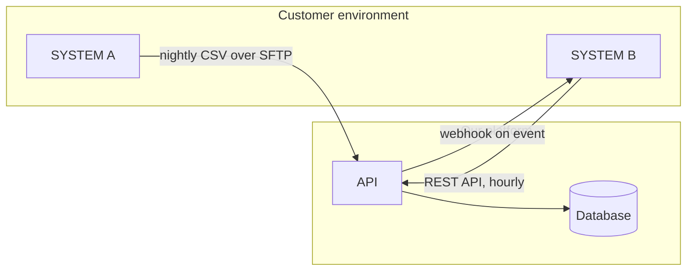
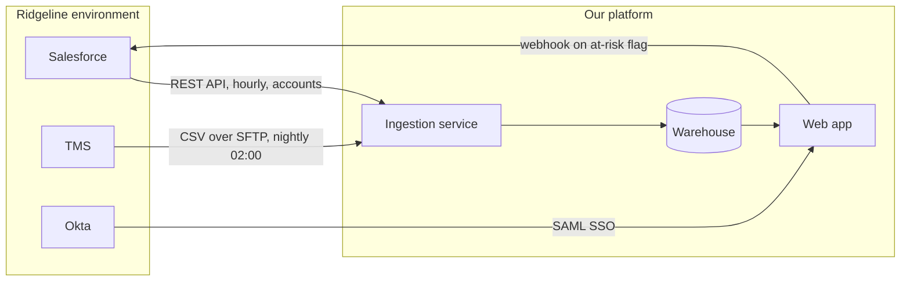

# Architecture diagram template

Used in modules 08 and 09. The deliverable an SE produces after discovery is
usually a picture plus a page of text, and this is that document.

Draw it in Mermaid, in a Markdown file, in the repo. GitHub renders it, it
diffs in version control, and you can change it in ten seconds during a call
when the customer says "actually, it's the other way around."

---

~~~markdown
# Solution architecture: CUSTOMER, DATE

## The problem in one paragraph

What the customer is trying to accomplish, in their words, and why the current
setup does not do it.

## Systems involved

| system | owner | role in this design | how it connects |
|---|---|---|---|
| | customer / us / third party | source, destination, or transformer | API, SFTP, webhook, iPaaS |

## The diagram

## Data flow, step by step

1. WHAT moves FROM WHERE TO WHERE, HOW OFTEN, in WHAT FORMAT.
2. ...
3. ...

## Field mapping

| their field | our field | transformation |
|---|---|---|

## Identity and access

- Authentication method:
- Provisioning (SCIM, manual, JIT):
- Roles and what each can see:

## Failure handling

| what fails | how we detect it | what happens | who is notified |
|---|---|---|---|

## Security notes

- Encryption in transit / at rest:
- Data residency:
- What data leaves the customer's environment, and what does not:
- Retention:

## Open questions

| question | owner | needed by |
|---|---|---|

## What this design does not do

Be explicit. Scope stated up front is scope you do not argue about in week six.
~~~

---

## Completed example

~~~markdown
# Solution architecture: Ridgeline Freight, 2026-09-18

## The problem in one paragraph

Ridgeline's account data lives in Salesforce and their product usage lives in
their internal TMS, which exports nightly. Nobody can see both in one place, so
at-risk accounts are found during renewal instead of 60 days before. They want
one current view and an alert when an account goes quiet.

## Systems involved

| system | owner | role in this design | how it connects |
|---|---|---|---|
| Salesforce | customer | source of account records | REST API, hourly pull |
| TMS | customer | source of usage events | nightly CSV to SFTP |
| Our platform | us | joins, stores, alerts | receives both, exposes UI |
| Okta | customer | identity provider | SAML SSO |

## The diagram

## Data flow, step by step

1. Hourly, our ingestion service calls the Salesforce REST API for accounts
   changed since the last run and upserts them on `sf_account_id`.
2. Nightly at 02:00 their time, the TMS drops `usage_YYYYMMDD.csv` onto our
   SFTP endpoint. Ingestion validates the header, loads it, and moves the file
   to an archive prefix.
3. A scheduled job joins usage to accounts and recomputes the at-risk flag.
4. When an account newly becomes at-risk, we POST a webhook to Salesforce to
   create a task for the account owner.
5. Users sign in to the web app with Okta SAML and see only their region.

## Field mapping

| their field | our field | transformation |
|---|---|---|
| `Account.Id` | `customer.external_id` | none, used as the match key |
| `Account.Name` | `customer.company_name` | trim whitespace |
| `Account.BillingCountry` | `customer.country`, `customer.region` | ISO code to name, region derived |
| `usage.event_time` | `usage_events.event_ts` | local time to UTC |

## Identity and access

- SAML SSO via Okta, SP-initiated. SCIM deferred to phase 2; users are created
  on first login with a default role.
- Three roles: ops coordinator (own region), manager (all regions), admin.
  Enforced server-side on every query.

## Failure handling

| what fails | how we detect it | what happens | who is notified |
|---|---|---|---|
| Nightly CSV missing | no file by 04:00 | yesterday's data stays; flag marked stale | their ops alias and our support |
| Salesforce API 429 | rate limit response | exponential backoff, retry for 1 hour | our support only |
| CSV schema change | header validation fails | file rejected, not partially loaded | both, immediately |

## Security notes

- TLS 1.2+ in transit, AES-256 at rest.
- US region only; no data residency requirement stated.
- No PII beyond business contact name and email leaves their environment.
- Raw files retained 30 days, then deleted; derived data retained for contract
  term.

## Open questions

| question | owner | needed by |
|---|---|---|
| Confirm SFTP key exchange method | Marcus | before POC start |
| Does the TMS export include deleted records? | Marcus | week 1 of POC |

## What this design does not do

No write-back to the TMS. No real-time usage; the freshest usage data is from
last night. No SCIM deprovisioning in phase 1, so removing a user in Okta
blocks login but does not delete their record.
~~~

The last section is the one people skip and the one that saves the project.
